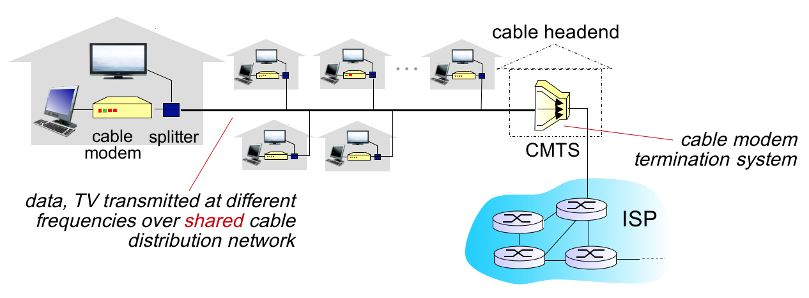
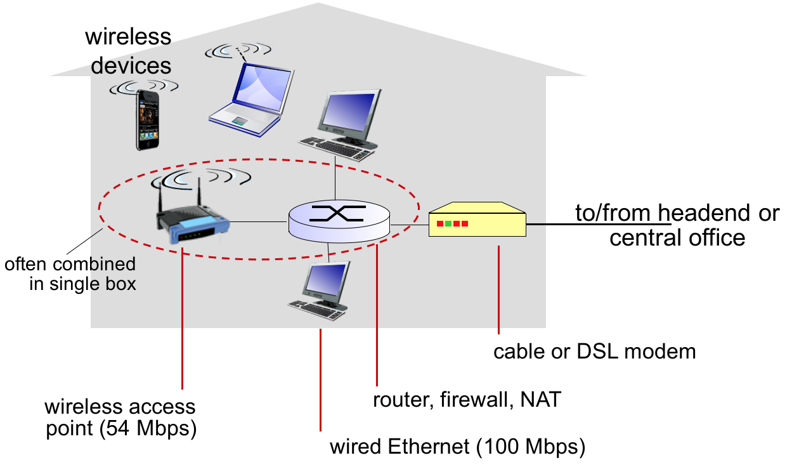
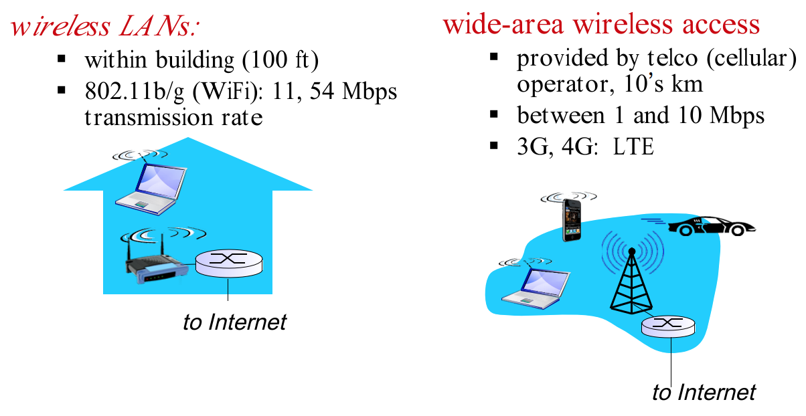

# 목표

1. 컴퓨터 네트워크의 계층적인 프로토콜 구조 이해

2. 인터넷에서 사용되고 있는 응용 프로그램, 트랜스포트, 프로토콜, 라우팅 알고리즘과 프로토콜에 대해서 집중적으로 학습

3. 네트워크의 자원 활용율을 높이고 사용자에 대한 서비스를 향상시킬 수 있는 네트워크 프로토콜 설계 및 분석 능력 배양

다양한 네트워크들이 있지만 그 중에서 **인터넷**을 대상으로 강의 진행.  
가장 보편적으로 알고 있고, 가장 규모가 큰 네트워크가 인터넷이기 때문! 

# 1. 인터넷은 무엇인가?

인터넷 = 덩어리, 라고 생각해 보자

|위치|설명|
|---|---|
|가장자리| **host** 또는 **end system** (e.g. 컴퓨터, 서버) 이전에는 데스크탑뿐이었지만 요즘은 대부분의 가전들이 해당됨 (communcation 이 가능한 장비)|
|중앙|사용자의 메세지가 올바른 목적지를 찾아가게끔 하는 장치  **router** : 다양한 네트워크를 동시에 연결하는 것이 목적  **switch** : 다양한 device를 동시에 연결하는 것이 목적|

 

* **link** : router & switch 또는 host & route 들을 연결해주는 것. 물리적인 실제 회선

* router, switch 는 덩어리/뭉치로 연결되어 있음. 그래서 인터넷은 **네트워크들의 네트워크**

* **프로토콜**은 이러한 인터넷에서 메세지를 주고 받는 것을 제어하는 모든 **일련의 규칙**

# 2. 프로토콜이란?

* 통신하는데 관련된 모든 규약

* 컴퓨터 네트워크에서 source 와 destination은 **정해진 규격**에 따라서 통신을 해야함 (사람의 대화 형태와 다름)

* 다양한 규약이 필요함 -> 방대 -> **계층적**으로 정의가 되어 있음 

* 표준화가 매우 중요

### 기타사항
* 인터넷 프로토콜의 표준화 기관은 IETF(Internet Engineering Task Force)
* RFC(Request for comments) 라는 표준안을 계속 발표
* 처음으로 인터넷 프로토콜을 만든 사람들이 대학원생이 었음

# 3. 프로토콜이 정의하는 것은?

* 보내고 받는 메시지의 포맷

* 보내고 받는 순서

* 어떤 메시지를 받았을때 어떤 액션을 취해야 하는지

# 4. 프로토콜 계층

* **아래계층**으로 내려갈수록 **물리적인** 네트워크 컴포넌트에 더 직접적으로 연관되어 있음

* **윗계층**으로 올라갈수록 사용자의 **application program**에 더 가까운 프로토콜 정의

* 계층마마다 다른 프로토콜이 사용됨

* 우리가 사용하는 교재는 위에서 아래로 내려감 (전에는 아래에서 위로 가는 경우가 대부분)

### 기타사항
* OSI(Open System Interconnection Reference Model)
* TCP/IP(Transmission Control Protocol / Internet Protocol)
* OSI 참조모델은 국제표준화 기구 ISO 에서 만든 데이터 통신의 단계 구성도로 네트워크 연결간의 어려움이 많아 호환성 결여를 막기위하여 개발
* 실질적인 통신에는 TCP/IP 모델이 사용됨 (OSI는 데이터 통신을 설명하는데 매우 유용)
* 각각의 계층에는 다양한 프로토콜이 있음

# 5. 네트워크 구조

* **Network edge**: host 또는 end system

* **Network core** : router, switch

* **Access network** : **host 또는 end system 을 네트워크에 연결**해주는 역할

    * bandwidth 라는 중요한 특징을 가짐. **시간당 실어나를 수 있는 비트 수**

    * shared / dedicated 여부가 중요함 ( e.g. 와이파이는 shared)

**데스크탑 인터넷, 누가 연결해줘?** 전화회사 또는 케이블 회사

이 회사들이 우리에게 access network 를 제공해 주는 것

# 6. Access network - 전화 회사

* DSL : digital subscriber line (예전 약어)

* DSLAM : digital subscriber line access multiplexer

* 집이 전화회사의 central office 에 연결되어 있어. 다른집과 공유 x -> **dedicated**

* 데스크탑은 DSL 모뎀과 연결되어 있음

* 전화 목소리, 컴퓨터 데이터 다 **splitter** 로 이동 -> central office

* central office 에는 DSLAM 이라는 **멀티플렉서**가 있음 -> 목소리는 전화 네트워크 쪽으로, 데이터는 인터넷 쪽으로 전달

* DSLAM : 집을 인터넷에 연결해주는 **access network**

* upstream bandwidth < downstream bandwidth (우리는 데이터 생성자 보다는 소비자에 가까우니까)

기타사항
* isp (internet service provider) : 개인이나 기업에게 인터넷 접속 서비스, 웹 사이트 구축 등을 제공하는 회사

# 7. Access network - 케이블 회사

* CMTS : Cable Modem Termination System

* 데스크탑은 케이블 모뎀과 연결되어 있음

* **Splitter** 를 통해 케이블 회사의 cable headend 로 이동 ( 전화회사의 central office 와 유사)

* Cable headend 에는 **CMTS** 이라는 **멀티플렉서**가 있음 -> 데이터를 인터넷으로 넘겨주는 역할

* CMTS : 집을 인터넷에 연결해주는 **access network**

* 여러 집이 하나의 회선을 공유 -> **shared**-> **bandwidth**가 매우 커야함

* **hfc** (hybrid fibre coax) : 매우 큰 대역폭/bandwidth 를 제공하기 위한 선로망

* downstream bandwidth 의 경우, 전화와 절대적인 값으로만 비교를 하면 안됨. 케이블 네트워크는 여러집에서 나눠써야 한다는 것을 고려해야 함.

# 8. Access network - Home network

* 기기 -> home network -> 전화/케이블회사 network -> 인터넷

* Home network 의 중심에는 **router** -> 집에 있는 여러 end system을 묶어서 네트워크에 연결하는 역할 

* **WAP** 는 일반적으로 router 에 연결이 되어 있음

* 데스크탑 -> **router -> 케이블 / dsl 모뎀** -> 전화/케이블 회사 network -> 인터넷

# 9. Enterprise access network

* end system 들이 훠어얼씬 많음. router 하나 가지고는 안됨 -> **ethernet switch**

* e.g. 실습실 안에 **ethernet switch**가 있음. 컴퓨터와 ethernet switch 를 연결하는 케이블들  은 다 바닥 아래에. 

* ethernet switch 가 한 방/층/건물 안에 있는 end system 다 연결 해줌 -> 방/층/건물이 여러개면? switch 도 여러개

* **WAP** 는 **ethernet switch**로 연결이 됨

* **ethernet switch** 들은 학교/회사 전체를 연결해주는 **router**로 연결이 됨

* **router**는 **ISP 의 router**로 연결이 됨

* WAP / 기기 ->  ethernet switch -> router -> isp의 라우터

* 집과의 차이점

  * 내부에서 발생하는 데이터의 양이 큼 -> 장비의 규모와 수가 다름

  * 전화/케이블 회사에서 인터넷에 연결해주지 않아

  * 학교를 대표하는 **router**가 ISP 의 라우터에 **직접 연결**을 해 (dedicated line)

  * dedicated line 은 ISP가 직접 깔아줌 ( 전화/케이블 회사 x)

|장소|구현|
|---|---|
|집|라우터를 중심으로 집안의 여러 엔드시스템 연결 -> 모뎀 -> 케이블/전화회사 -> isp|
|회사/학교|기기 -> ethernet -> 학교 전체를 엮어주는 router -> isp|

# 10. Wireless access network

* (회사/학교) 폰 -> WAP -> ethernet switch -> router -> isp 

* (집) 폰 -> WAP -> router -> 케이블/전화 회사 -> isp  

* wifi, 셀룰러 둘다 **shared network & wireless network**

* 셀룰러와 달리 wifi 는 주로 내부에서만 사용 가능. 셀룰러  -> wide-area wireless access
