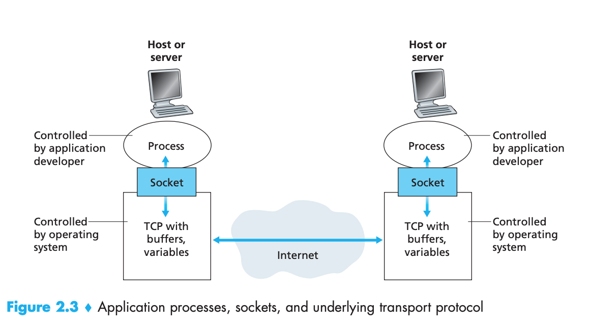
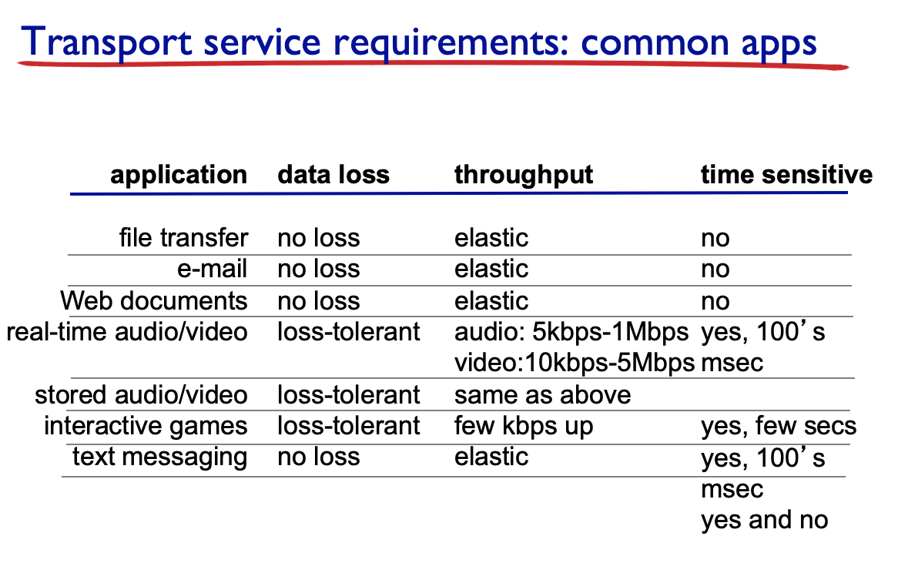
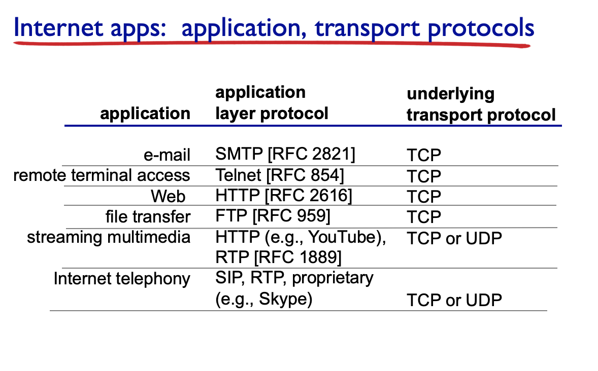

프로토콜 계층 중 Application 계층에 대해 배울 것.

앞으로 사용할 용어들의 기본적인 개념이 등장하기 때문에 확실히 알고 넘어갈 것

1. Application protocol의 구조와 개념
2. 실제로 사용되고 있는 application 프로토콜들을 살펴볼 것 (실례들)
3. 직접 network application을 작성할 수 있는 interface (socket API)를 배울 것

## network applications

- email, web, multi-user network games, YouTube(streaming stored video).. Skype(internet phone), social networking...

- 네트워크 애플리케이션 프로그램은 종단시스템에만 존재한다. 라우터, 링크 계층 스위치와 같이 네트워크 코어에서 실행되는 소프트웨어를 작성할 필요는 없다.

  

## Application architectures

network application과 그 application을 지원하는 **application protocol** 의 possible structure은 두 가지이다.

- client-server

- peer-to-peer (P2P)

  

## Client-server Architecture

커뮤니케이션의 실질적 주체는 컴퓨터에서 실행되고 있는 **프로세스**이다. (''컴퓨터 - host'' 자체가 아니라)

client-server architecture인 경우에는 하나의 host는 server가 되고 나머지 하나는 client가 된다.

#### 1. Server host

- always-on host

  -> conceptually, host는 항상 on 상태여야 한다. 현실세계에서는 시스템 문제로 shut down될 때가 있지만, 

- 영구적으로 할당된 IP주소를 가지고 있음

- 클라이언트가 많을 때는 여러 클라이언트에 대응하기 위해 data center 형태로 같은 역할을 하는 server가 군집된 형태를 이루기도 함

  

#### 2. Client host

- server와 communication을 함 (client끼리 통신하는 경우는 없다.)
- 인터넷에 intermittently(간헐적으로 - 연결됐다가, 안됐다가..) 연결되어 있다.

- dynamic IP주소를 할당받는 경우가 많다. (인터넷에 connect될 때마다 변경이 가능한 주소)

=> C-S architecture에서는 server host의 **process**와 client host의 **process**가 서로 통신하게 된다.

## P2P architecture

- 통신하는 두 process가 모두 user host에 sitting하고 있음.

- 이 host는 서비스 제공자가 소유한 것이 아니라, 사용자들이 제어하는 데스크탑과 랩탑같은 것이 됨.

- no always-on server, arbitrary user host(**peer**)끼리 통신을 하는 것.

- peer는 다른 peer에게 서비스를 요청하기도하고, 다른 peer에게 서비스를 제공하기도 한다.

  - **self scalability(자가 확장성)** : 별도의 서버가 없고 peer들끼리 서로 서비스를 주고받기 때문에 어떤 peer가 새로 join하면 그 peer는 request만 늘리는 것이 아니라 service capability(서비스 능력)을 추가한다. 서비스의 규모가 커지더라도 self scale할 수있는 경향이 있다

    client-server architecture는 client가 많아지면 server를 늘려야 함.

- peer는 user host기 때문에 인터넷에 intermittently연결됨. IP주소도 바뀔 수 있음. -> 관리가 복잡하다는 단점

- BitTorrent, Skype

  

## Processes communicating

- 커뮤니케이션의 주체는? host가 아니라 host에서 실행되고 있는 프로그램인 **process**

- **inter-process communication**: 같은 host내의 process 간의 통신. 이 통신의 규칙은 OS에 의해 정의된다.
- 서로다른 host의 process간의 통신: 컴퓨터 네트워크를 통해 **message**를 교환함으로써 통신한다.

#### client process와 server process

- client process

  - communication을 초기화(initiate)하는 process. (다른 프로세스와 세션을 시작하려고 접속을 초기화하는 프로세스)

  - client-server architecture에서는 client host에서 실행되고 있음

- server process

  - 대기하고 있다가 client의 contact를 받으면 그것에 응대하는 process. (세션을 시작하기 위해 접속을 기다리는 프로세스)

  - client-server architecture에서는 server host에서 실행되고 있음

- p2p아키텍처에서는

  - 하나의 host(peer)안에 client process와 server process가 동시에 실행되고 있을 수 있음

  

#### Sockets

- process는 소켓을 통해 네트워크로 메세지를 보내고 받는다.
- application 계층에서는 message를 만들어서 transport계층에 부탁한다.
- socket: host의 application layer와 transport layer 간의 인터페이스, 애플리케이션과 네트워크 사이의 API.
  - 애플리케이션 개발자는 소켓의 application layer에 대한 모든 통제권을 갖지만, transport layer에 대한 통제권은 거의 갖지 못함.
    - transport protocol의 선택(선택이 가능한 경우), 최대 버퍼와 최대 세그먼트 크기와 같은 약간의 매개변수 설정 정도

- transport 이하계층은 OS에 의해 control된다.

#### Addressing processes

- (다시한번 말하는데..) 커뮤니케이션은 두 host간에 이루어지는 것이 아니라 각 host에 존재하는 process 간에 이루어지는 것이다.
- message delivery를 위해서는 host의 id(IP 주소) 뿐만 아니라, 수신 process(정확히 말해 수신 소켓)를 식별할 수있는 정보도 필요함.

- **port numbers**: host에서 실행되고 있는 process를 identify해줌

#### well known port numbers

- popular application에는 특정 포트 번호가 할당되기도 한다.

- HTTP: 80. Web application을 위한 프로토콜. 

- mail server: 25

- 그 외 ssh 22, https 443...

  

## application이 이용 가능한 transport 서비스

#### transport service가 application에 제공할 수 있는 서비스들

- **data integrity** (신뢰적 데이터 전송)
  - 어떤 앱(file transfer, web transactions 등)은 100% reliable data transfer를 필요로 한다.
  - 반면 some loss가 용인되는 앱도 있다.(ex. audio service)

- **timing**
  - ex, 수신자가 송신자에게 보내는 모든 비트가 100msec내에 도착하는 것을 보장
  - 인터넷 전화, 가상 환경, 원격회의, interactive games와 같이 low delay를 요구하는 application에 매력적일 것.

- **throughput** (처리량)

  - minimum throughput을 보장
  - multimedia streaming와 같은 **bandwidth-sensitive application** - 단위시간 당 필요한 frame을 반드시 deliver받아야 함.

  - 반면 어떤 app들은 이것을 필요로 하지 않음 - **elastic apps** (traditional한 data applications - ftp같은거는 좀 늦어져도 크게 불편하지 않음)

- **security**
  - 어떤 앱들은 encryption이나 data integrity 요구

- stored audio/video는 real-time one에 비해 다소 덜 time-sensitive하다. 저장된 매체는 buffering을 해서 어떤 frame이 제시간에 도착하지 못해도, buffering되어있는 데이터로 make-up 가능

## 인터넷에서 transport service를 제공하는 protocol

#### TCP

- reliable tranpost: 상대방에게 오류없이 순서대로 배달

- connection-oriented

  - application layer 메세지를 전송하기 전에 client와 server가 서로 전송 제어 정보를 교환하도록 함. 상대방 tcp와 hand-shaking을 해서 connection 확보하는 것.
  - 이 단계를 지나면 **TCP 연결**이 두 process의 소켓 사이에 존재한다고 말함.
  - 이 연결은, 애플리케이션이 메세지 전송을 마치면 끊어야한다.

- flow-control

  - sending/receiving TCP는 각각 buffer를 갖고, buffer로부터 application으로 message를 보낸다. 
  - connection이 있기 떄문에 buffer overflow를 막을 수 있어 정보 손실을 방지할 수 있다.
  - receiving TCP의 overflow를 막는 control

- congestion control

  - sending/receiving TCP 사이의 network에 존재하는 router의 overflow를 control
  - network의 congestion을 피하기 위한 control
  
  

#### UDP

- unreliable data transfer, no congestion control.

- TCP가 저렇게 fine한데 왜씀? 

  - contol를 위해 connection. connection 을 manage하는 protocol control overhead가 크다.
  - one-time transaction처럼 간단한 통신을 위해 이 모든 절차를 이용할 필요가 없다.
  - application 자체가 data integrity를 확인한다면 transfer계층에서 reliability를 보장하는 것은 반복적인 행동일 수 있음

  - flow control과 congestion control이 문제가 될 수있다. (minimum throuput을 요구하는 multimedia streaming을 생각해볼 것)

#### 둘 다 제공하지 않는 것

- minimum throuput guarantee, timing, security

- 현재 인터넷에는 이러한 것들을 다뤄주는 transfer protocol이 없는 것. 연구가 많이 되었지만 실제로 deploy된 것은 많지 않다. TCP나 UDP를 보완해주는 protocol이 쓰이고 있기는 하다.(이번엔 안배우지만)

- multimedia streaming에 대한 수요가 많이 늘어났지만, 그것이 요구하는 timing, minimum throughput을 제공하는 protocol은 아직 없다.

- 현존하는 protocol은 data integrity의 제공 여부에 의해 나뉘는 2가지 뿐

## 보편적으로 사용되는 Internet apps

- 인터넷 전화(예를들어 스카이프)는 일반적으로 UDP에서 자신들의 application을 수행하기를 선호하나, 많은 방화벽들이 대부분의 형태의 UDP 트래픽을 차단하도록 설정되어 있기 때문에, 실패할 경우를 대비하여 TCP를 사용하도록 설계되어 있다.

- 현대의 application의 요구사항(multimedia streaming)과 현존하는 transfer protocol의 스펙에 mismatch가 있다.

  

## Application layer protocol

#### Application layer protocol이 정의하는 것

- 교환하는 message의 종류

  e.g., request, response

- message의 syntax

  메세지 내부의 필드와 필드 간의 구별 방법

- message semantics

  각 필드에 있는 정보의 의미

- rules

  언제 어떻게 메세지를 보내야하고, 메세지에 응답해야 하는지 결정하는 규칙

  

#### Application protocol의 종류

- open protocols

  - ex. HTTP, SMTP

  - RFC document에 다 open되어 있음
  - 유용한 점 : interoperability가 좋음. 어떤 application이라 할지라도 그 규약만 따르면 서로 통신할 수 있기 때문에

- proprietary protocols
  - 실제로 어떻게 동작하는지 알려지지 않음. ex. Skype

