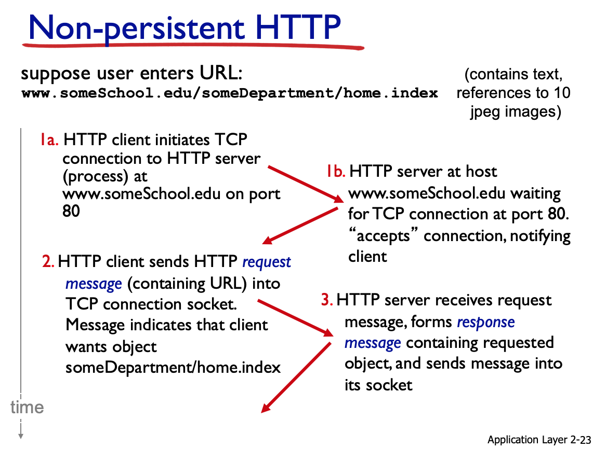
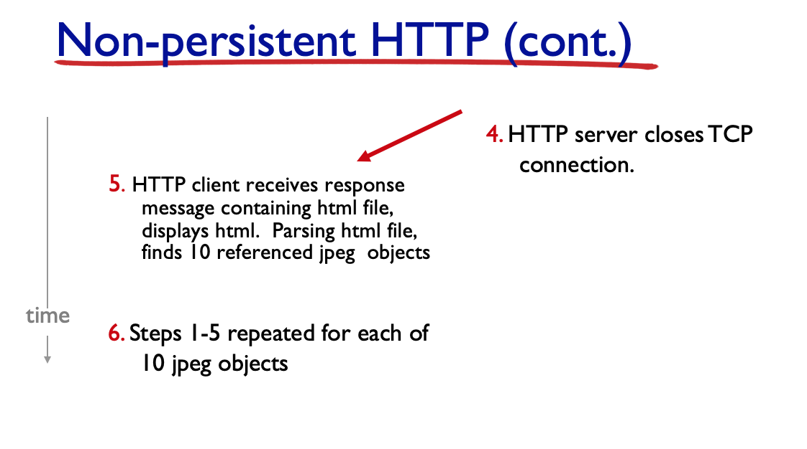
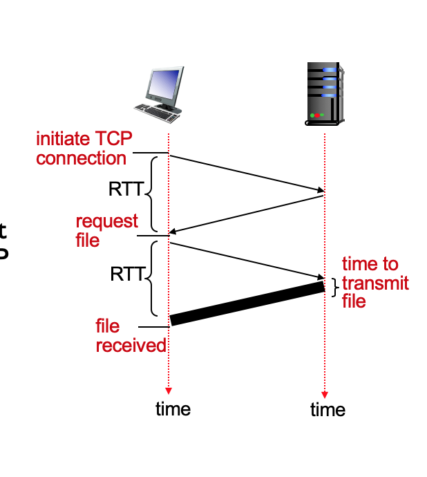
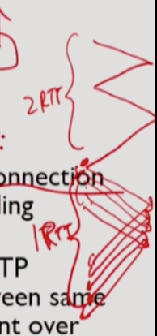
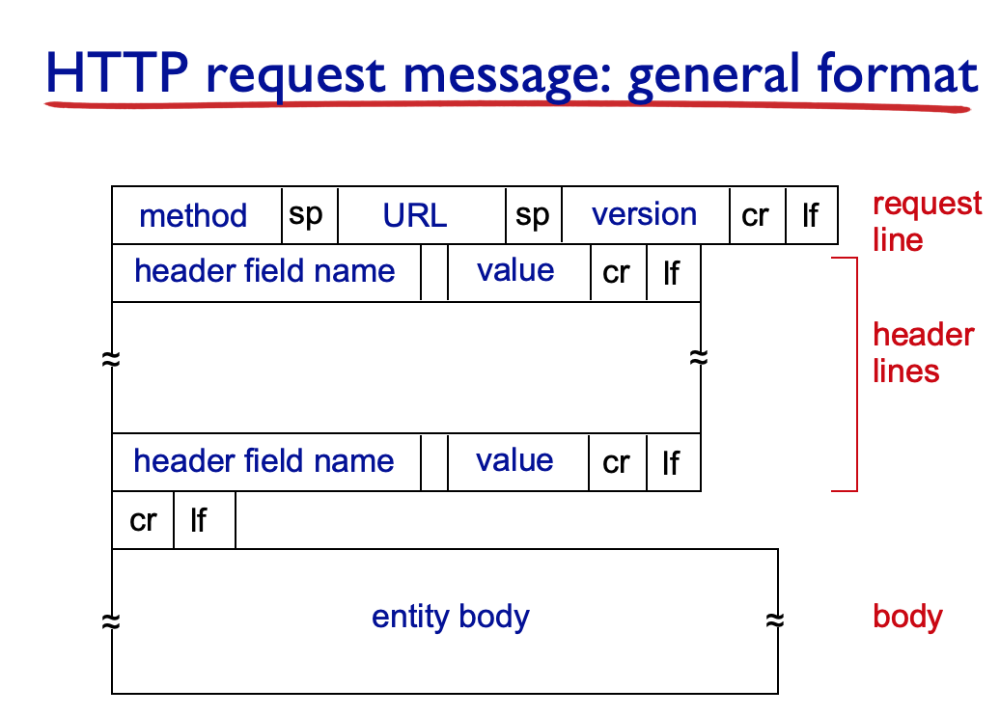
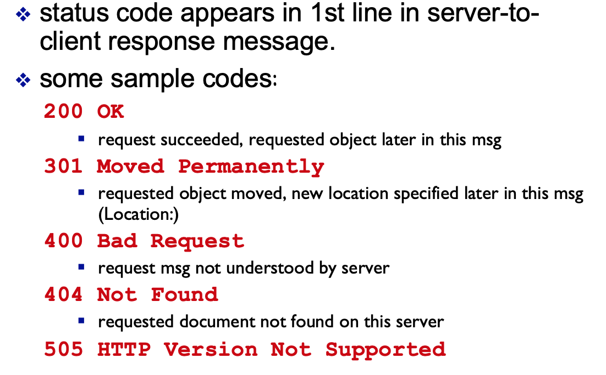

인터넷의 가장 보편적인 protocol 다섯가지에 대해 배울 것

# Web and HTTP

HTTP는 여러 application에서 사용되고 있으나, 가장 대표적으로 Web application에서 쓰인다.

#### Web page

- 여러 **object**로 구성된다.

  - objects: 단순히 단일 URL로 지정할 수 있는 하나의 파일
    - HTML file, JPEG image, Java applet, audio file...

  - 대부분의 웹 페이지의 구성
    - base HTML file과 각 object에 대한 reference. 이 reference는 URL 형태


## HTTP overview

##### HTTP: hypertext transfer protocol

- originally designed for **Web application**

  -> 다른 application(multimedia streaming 등)에서도 쓰인다.

- client-server model
  - client process
  
    - web browser
  
    - 사용자로부터 url을 받아서 웹 서버에 요청하고, 응답을 받아서 Web objects를 display한다
  
  - server process
  
    - browser들의 contact를 기다린다
    - URL로 지정될 수 있는 Web objects를 가지고 있다.
    - request를 받으면 해당하는 objects로 응답
    - 인기있는 웹 서버: 아파치, 마이크로소프트 인터넷 인포메이션 서버


- application program이 달라도 (firefox browser이든 safari browser이든 상관없이) 같은 http protocol을 사용하기 때문에 web server와 통신 가능. (application program과 application protocol의 차이)

  

#### HTTP는 TCP를 통해 네트워크 통신

- 웹은 data integrity가 중요하기 때문에, TCP를 사용한다.
- http request message를 전달하기 전에, TCP connection을 맺음.
- server가 TCP connection을 accept 
- 그 connection을 통해 http request message 보냄. response 받음.
- TCP connection closed.


#### HTTP는 stateless하다.

- 서버는 client의 request history를 기억 안함.

- 저장자체도 overhead 발생시키며, crash 가 발생하면 server와 client의 view를 일치시키는 데도 상당한 cost 들어감

- 많은 protocol이 stateless함. (과거의 transaction 기억 X)

```
무상태 디자인은 서버 디자인을 단순하게 만드는데, 진행 중인 송수신 정보를 처리하기 위해 저장 공간을 동적으로 할당할 필요가 없기 때문이다. 클라이언트가 트랜잭션 도중 죽으면, 시스템의 어떠한 부분도 서버의 현재 상태를 청소할 필요가 없다.

무상태의 단점은 매 요청마다 추가 정보를 포함할 필요가 있으며, 이 부가 정보는 서버가 해석해야 한다.
출처: 위키백과
```


#### HTTP connections

- non-persistent HTTP

  한 connection에 하나의 object만

- persistent HTTP

  한 번의 connection에 여러 object

  

#### Non-persistent HTTP 통신 과정





1. TCP 연결. 클라이언트와 서버에 각각 소켓이 있게 됨.

2. 클라이언트가 1에서 설정된 TCP 연결 소켓을 통해 서버로 HTTP 요청 메세지를 보냄.
3. HTTP 서버는 1에서 설정된 연결 소펫을 통해 요청 메세지를 받고, 저장장치로부터 요청받은 객체를 추출한다. HTTP response message에 그 객체를 캡슐화한다. 응답 메세지를 소켓을 통해 클라이언트로 보낸다.
4. HTTP 서버는 TCP에게 TCP 연결을 끊으라고 한다. (그러나 실제로 TCP 클라이언트가 응답 메세지를 올바로 받을 때까지 연결은 끊어지지 않는다)
5. 그 이후 참조되는 각 객체에 대해 1-4를 반복한다.


### Non-persistent HTTP의 response time

- Response time: url typing -> web page display 사이의 delay

- RTT(Roud Trip Time) : 아주 작은 packet(packet을 medium에 밀어넣는 데 걸리는 시간을 무시해도 될 만큼 작음)이 client -> server -> client 하는 시간
- HTTP response time
  - 1 RTT : initiate TCP connection
  - 1 RTT : HTTP request and first few bytes of HTTP response to return
  - file transmission time


웹페이지 전체가 다 오는 시간은?

- non-persistent



- 2 RTT per object

- file transmission time은 무시할만하다고 가정하고
- object num - n이면 n * 2RTT

-> parallel하게 하기도 함.


- persistent




### HTTP request message

2개의 type: request, response

ASCII 로 작성




#### user form input을 서버에 전달하는 법

- POST method

  - entity body에 input 메세지를 포함할 수 있다.

- GET method

  - URL을 통해 input 포함

    `www.somesite.com/animalsearch?monkeys&banana`


#### HTTP response

**status code**



