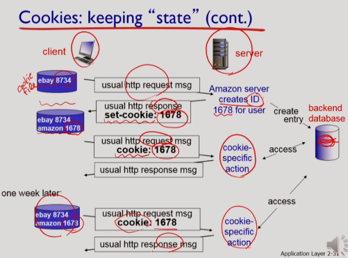
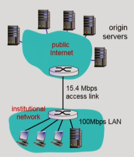
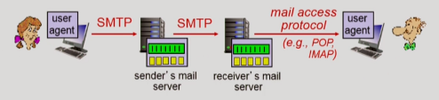
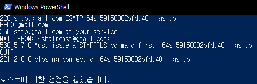

# Cookies

- Http는 stateless 프로토콜. Stateless protocol은 관리가 씸플하다는 장점이 있다.
- 하지만 State(예를 들면 Client의 Transaction history)를 가짐으로서 줄 수 있는 이점들을 못준다.
- 그 이점들을 챙기고자, Stateless 프로토콜에서 Stateful 하기 위해, Cookie를 사용.

#### 네 가지 컴포넌트

- Server reponse의 **Cookie header line.**
- Server Backend의 **Database.**
- Client request의 **Cookie header line.**
- Client(user's browser)의 **Cookie file.**

#### 시나리오

1. 사용자가 Client에서 웹사이트를 최초로 접속(request).
2. Server는 사용자에 따른 **unique id를 생성**하고(이 id는 서비스마다 따로 관리됨).
3. Server는 이 unique id에 해당하는 entry를 **backend database에 저장.**
4. 그리고 unique id를 response **header의 set-cookie 구문에 넣어서 Client로 보냄.**
5. Client는 이 unique id를 받아서, **Cookie file에 저장.**
6. Client는 다음 request부터 **header의 cookie 구문에 id를 넣어서 request**를 날림.
7. Server는 이 id를 가지고 backend database를 참조하여 cookie specific action을 할 수 있다.

#### 쿠키로 할 수 있는 일

- 사용자 인증. 서버에 인증정보(id/pw)를 보내고 나서 쿠키를 받으면, 이어지는 인증과정은 쿠키로 대체.

- 사용자의 transaction history를 저장할 수 있으므로 쇼핑카트, 추천 등도 가능해짐.
- 결국 "유저 세션을 유지"할 수 있다는 것.

정리: http 프로토콜 자체는 상태를 가지지 않기 때문에, **각 엔드포인트에서 상태를 저장한다(cookie file, db).** 여기서 클라이언트 쪽에 저장되는 것을 쿠키라고 말하고, 메시지의 헤더에 이 정보를 담아서 보낸다.

# Web Cache

- 본 서버까지 가지 않고 로컬에서 오브젝트를 가져오기 위함이다.

- 서버같은 역할이라 Proxy Server라고도 부름.

- 브라우저는 웹캐시를 통해서 본 서버로 request를 보내는데, 이미 웹캐시에 요청한 오브젝트가 있으면 본서버까지 들르지 않고 바로 웹캐시에서 쌔벼온다.

  

#### 장점

- 클라이언트 입장에서 **response가 빠르다.**
- ISP 입장에서 access link의 **트래픽을 줄일 수 있음.**

- 특히 poor content provider의 content 제공을 도움.

#### 예시

- Intitutional network는 access link로 internet의 pop(point of presence)에 연결됨.
- Access link의 bandwidth가 충분하지 않으면 utilization(traffic intensity)이 높아져 access delay가 엄청 커진다.
- Access link의 bandwidth를 늘려서 해결할 수 있지만 비용이 많이 든다.
- 이 때 **local web cache**를 두면 저비용으로 access link의 utilization을 확 줄일 수 있다. 줄어드는 정도는 웹캐시의 **hit rate(request에서 요구하는 오브젝트가 웹캐시에 있는 비율)**에 따라 결정된다.

#### Conditional GET

- 이런 로컬캐시의 문제점은: 본 서버의 오브젝트는 업데이트되었는데 캐시가 이를 알지 못하면, 사용자가 **outdated된 오브젝트**를 보게 된다는 점이다. 여기서 Conditional GET이 등장.
  - 3월 13일에 사용자가 A라는 오브젝트를 request해서 본 서버로부터 response를 받았다고 하자. 이 response에는 A와 함께 A의 last-modified 시간 정보가 있다.
  - 3월 14일에 사용자가 또 A라는 오브젝트를 request를 한다고 하자. request를 받은 캐시서버는 **본 서버에 request**를 보내는데, **header의 If-modified-since에 last-modified 시간을 실어서 보낸다.** 
  - 본 서버는 이 request를 받아서 자기가 가지고 있는 A의 last-modified 시간과 비교한다. A가 새로 업데이트된 부분이 없다면 304 Not Modified 라고만 response를 준다. A가 그 이후 modified 되었다면 200 OK data라는 메시지와 함께 A를 response로 준다.

- 매번 이런 체크를 하면 항상 up-to-date 오브젝트를 받아오지만, response가 다소 느려져 캐시의 장점이 퇴색된다. 특정한 경우에만 이런 체크를 하면 가끔 up-to-date를 못받기는 하겠지만 캐시의 장점을 살릴 수 있다. 그래서 '언제 체크를 할 것인지' 전략을 짜는 것이 중요하다.
  웹캐시 전략에 대한 글: https://pjh3749.tistory.com/264
  캐시 컨트롤을 위한 헤더 구문: https://developer.mozilla.org/ko/docs/Web/HTTP/Headers/Cache-Control

# Electronic mail

#### 구성요소

- **user agent**: 사용자가 메일을 작성하고 읽는 클라이언트.

- **mail server**: 수발신 메시지가 저장되는 서버.

  - 수신함은 mailbox는 각 유저마다 제공되지만
  - 발신대기열인 mail queue는 모든 유저가 서버의 큐를 공유함.

- **mail protocols**(SMTP, POP4, IMAP 등)

  

#### SMTP를 통한 메일 전송 단계

1. **Handshaking(greeting)**: SMTP는 TCP 위에서 이루어지므로 tcp connection을 먼저 맺어야 한다. 25번 포트번호를 사용한다. 한 번 connection을 맺으면 QUIT하기 까지 계속 message transfer가 가능하다.
2. **Transfer of messages**: 옛날 스펙에는 header와 body가 모두 7bit ASCII여야 했으나 지금은 다양하게 보낼 수 있는 프로토콜이 정의가 되어있다. 클라이언트는 Command(ASCII 텍스트)를 보내고, 서버는 Response(status code+phrase)를 보낸다.
3. **Closure**: end of message는 CRLF . CRLF 

Telnet으로 접속해봤는데, 요즘 웬만한 웹메일서버는 교수님이 보여주신 Sample SMTP interaction이 보안상 불가능합니다(https://stackoverflow.com/questions/10509699/must-issue-a-starttls-command-first). 해보실 분은 여기의 예제와 명령어들을 참고(https://www.samlogic.net/articles/smtp-commands-reference.htm).

#### http와 SMTP의 비교

- http는 서버로부터 가져오는 pull 프로토콜이고, smtp는 서버로 보내는 push 프로토콜이다.
- 둘 다 command/response 구조고 status code와 phrase를 가진다.
- http는 response 하나에 object를 각각 담는데, smtp는 multipart msg에 multiple objects를 담을 수 있다.

