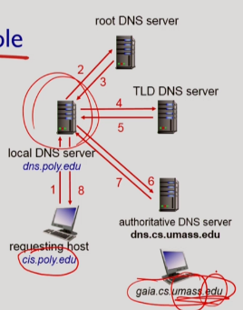

# Electronic mail(계속)

#### Mail Access Protocols

- SMTP가 push하는 프로토콜이라면, Mail Access Protocol은 pull하는 프로토콜

- 전통의 POP, 업그레이드 된 IMAP, 웹메일에는 HTTP.

#### POP3(Post Office Protocol Version 3)

1. **authorization phase**
   - client commands: user, pass
   - server responses: +OK, -ERR
2. **transaction phase**
   - list: 제일 먼저 수행하는 명령. 메시지 번호와 메시지 사이즈를 알려줌.
   - retr: 메시지 내용 읽기
   - dele: 메시지 삭제
   - quit

**POP3 서버는 session간 stateless**하기 때문에 서버는 유저가 어떤 메일을 retr하고 dele했는지 모른다. 따라서 POP3를 사용하는 경우, **로컬머신에 메시지를 모두 다운로드**하고 나서 복잡한 메일 관리는 다 로컬머신에서 한다. 다운로드 후 메시지의 처리 방식에 따라 모드가 나뉜다.

- Download and delete mode: retr를 진행한 메시지를 dele하는 방식. 초기방식. 메시지가 클라이언트간 분산되어 저장되는 단점이 있다.

- Download and keep mode: dele없이 retr만 하는 방식. 접속 시마다 과거 메시지가 중복되어 다운로드되는 단점이 있다.

#### IMAP(Internet Message Access Protocol)

- **서버에서 user state를 session간 보존**한다. 즉 메시지 변경사항이 모두 서버에 반영됨.
- 메일 서버에서 모든 메시지를 관리하고 보존.
- 메시지를 폴더로 정리 가능.
- command가 POP3에 비해 복잡하고 필요 storage도 큼.

# DNS(Domain Name System)

- 우리는 일반적으로 서버를 naver.com 처럼 지칭하는데 이를 **hostname** 또는 **domain name**이라고 부른다.
- 웹브라우저 뿐 아니라 다른 네트워크 어플리케이션에서도 서버는 hostname 형식으로 표시.
- 하지만 서버와 클라이언트의 "프로세스"끼리 컨택할 때는 **32bit ip address**를 사용.
- 여기서 **hostname을 ip address로 mapping** **해주는 서비스**가 필요하게 되는데 이것이 DNS.
- DNS를 운영하는 서버를 **name server**라고 함.

#### 특징

- Distributed database: **계층 구조**의 다양한 네임서버(hierarchical distribute database)로 분산되어 있다.
  - DNS는 네트워크 세상의 **단일 장애점(Single Point of Failure: 동작하지 않으면 전체 시스템이 중단되는 요소)**이기 때문에 중앙화하기에는 무리가 크다. 트래픽도 엄청 몰리고, 네트워크를 쓰는 전 세계 모두가 필요한 방대한 시스템이기 때문에, 안전하게 유지보수할 수 있도록 세계적으로 분산해서 운영한다.

- Application-layer protocol: 모든 네트워크 프로그램이 쓰는 코어한 기능이기 때문에 network layer에서 구현하는 것이 맞을 수도 있지만, 복잡성 관리 문제로 그렇게 하지 않음(complexity at network's edge)

#### 서비스

- Hostname to IP address translation: 본분

- Host aliasing: 흔히 서버의 hostname은 기관 외부에서는 대표 이름을 사용하고, 내부에서는 내부 식별용 이름을 사용한다. 여기서 외부로 알려지는 대표 이름이 alias인데, DNS는 alias name을 발급해주고 이를 canonical name으로 translate 해주는 서비스도 한다.

- 해당 도메인의 mail server 알려주기

- Load distribution: hostname을 ip address로 translate 할 때, 웹서버 replica들의 IP address들을 모아놓고 트래픽을 round robin으로 분배.
  - Alias - Canonical - IP address set

#### Hierarchical distributed database

1. **Root DNS Servers**: **hostname과 TLD 서버의 매핑**을 맡고 있다. 12년 기준 전세계적으로 13개 정도.

2. **TLD DNS Servers**: 기능별(com/ org/ edu 등 - 미국 한정), 국가별(kr/ jp/ fr 등) 도메인 같은 Top Level Domain(TLD) 에 대한 DNS Server들이 Root밑에 있다. **hostname과 authorititive DNS 서버의 매핑**을 맡고 있다. 
   - com은 Network Solutions, edu는 Educause, kr은 한국인터넷정보센터에서 관리 중이라고 한다.

3. **Authoritative DNS Servers**: yahoo.com DNS servers/ amazon.com DNS servers 등 기관별 도메인에 해당하는 DNS서버. **hostname과 해당 기관 내의 실제 서버들의 ip address 매핑**을 맡고 있다.

- 위 계층 구조에 속하지 않는 **Local DNS name server(= default name server, proxy name server)**
  - Residential ISP, company, university 등이 로컬 네트워크에서 사용.
  - **Local 트래픽은 모두 Local DNS 네임서버를 먼저 거친다.** Local DNS 네임서버가 mapping을 가지고 있으면 자기가 처리하고, 없으면 hierarchy의 **root DNS 서버로 전달**.

#### DNS가 Query를 응답하는 방법

- **Iterated query**: Mapping을 가지고 있지 않을 때, 이를 알고 있는 서버를 알려줌.

  

- **Recursive query**: Mapping을 가지고 있지 않을 때, 이를 가지고 있는 서버에 스스로 요청. 상위 hierarchy의 로드가 커진다.

#### DNS Cache

- DNS는 query 정보가 자신을 거쳐가는 경우 그 결과를 cache한다.

- **로컬 네임 서버는 보통 TLD 서버를 캐싱**해둬서 root trip을 줄인다.
- Query result인 Mapping 정보에는 항상 **TTL(Time To Live)**이 함께 날아오는데, 이 기간으로 캐시의 만료시간을 정한다.
- TTL 동안에는 outdated data를 받을 수 있기 때문에, 이 부분을 보완하고자 IETF에서는 이를 update/notify하는 메커니즘이 제안되었다(RFC2136)

🐶 DNS protocol, messages는 다음 강의에 중복으로 설명되어 제외했습니다.

