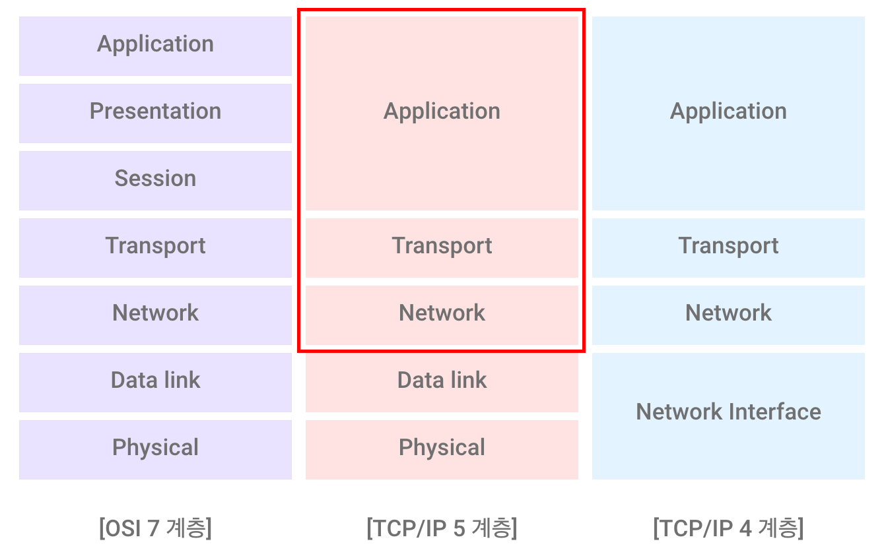

# Chapter 3. Transport Layer (2)

췝터 3. 트뤤스포트 레이어~ 레츠 기릿~~

## 0. 시작하기 앞서..

~~저는 멍청하기 때문에,, 불과 1주일 전 내용도 다 잊어버렸읍니다....~~

 

그래서 정리해보는 간단 복습 겸 알아두면 이해하기 좋을 것 같은 내용을 먼저 정리해봤습니다!

    Q1. 우리는 지금 어느 부분을 배우고있나?

저번 시간까지 **Application Layer**를 배웠고, 이제 **Transport Layer**를 배우고 있다!

    Q2. Application Layer 를 간략 요약하면?

- 종류 : **email**, **web**, multi-user network games, YouTube(streaming stored video).. Skype(internet phone), social networking...
  - (open protocols) HTTP, SMTP ... 
  - 이 어플리케이션 프로세스들은 Socket 을 통해 Transport Layer 와 통신한다.
- Application layer protocol 이 정의하는 내용 :
  - 교환하는 message의 종류 - e.g., request, response
  - message의 syntax - 메세지 내부의 필드와 필드 간의 구별 방법
  - message semantics - 각 필드에 있는 정보의 의미
  - rules - 언제 어떻게 메세지를 보내야하고, 메세지에 응답해야 하는지 결정하는 규칙
- HTTP, SMTP, POP3, IMAP, Cookie, DNS, P2P 등을 간단하게 살펴봤다

    Q3. (저번주에 공부한) Transport Layer 는 어떤 내용이었지?

- Transport Layer : 프로세스 간의 커뮤니케이션을 위한 프로토콜
  - network layer => host to host
  - Transport layer => process to process
  - 더불어, Network Layer 에서 제공하는 서비스를 개선할 수 있는 추가적인 서비스도 제공
    - ex - TCP : 네트워크 전송시 생기는 데이터 유실, 순서 등을 바로잡는 기능 제공
- 대표적인 TCP & UDP

| TCP(Transmission Control Protocol)        | UDP(User Datagram Protocol)     |
| ----------------------------------------- | ------------------------------- |
| reliable & in-order delivery & connection | unreliable & unordered delivery |
| + congestion control (혼잡제어)           |                                 |
| + flow control (흐름제어)                 |                                 |

- Multiplexing and Demultiplexing
  - process to process 프로토콜이 가장 기본적으로 해줘야 할 기능
  - 각 소켓이 메시지 전송을 요청
  - 각 메시지마다 목적지 확인해서 세그먼트의 header에다 도장을 찍어줌 (목적지는 header, 메시지는 payload)
  - **Multiplexing** 해서 이를 하나로 모아 network로 내려보내줌
  - 받는 쪽에선 세그먼트의 헤더를 확인해서 각 앱으로 **Demultiplexing**

- Segment Format
  

## 3.2. Multiplexing & Demultiplexing in UDP & TCP

#### 1. Connectionless Demux

- Connectionless 의 경우 서버는 어플리케이션을 위한 포트를 단 1개만 열게 된다

  => **Destination IP / Port만 보고** Demultiplexing이 일어난다.

#### 2. Connection-oriented Demux

- Connection-oriented 의 경우 서버가 특정 클라이언트만을 위한 소켓을 열게 된다 = 하나의 어플리케이션에 여러 소켓

  => Demultiplexing 을 위해서는 **Source IP / Port & Destination IP / Port 네 정보 모두 필요**

  - 목적지 IP / Port 를 보고 '어떤 어플리케이션' 에 해당하는 메세지가 전송되었는지 판단
    - Destination Port = Door Port
  - 소스 IP / Port 를 보고 특정 어플리케이션에 열려 있는 소켓 중 어떤 소켓에 메세지가 전송되었는지 판단

## 3.3 Connectionless Transport: UDP

프로토콜 UDP, TCP 를 자세히 살펴보자

#### 1. UDP (User Datagram Protocol)

**특징**

- Connectionless = no handshaking
- Each UDP segment handled independently of others = 받는쪽에서 동일한 클라이언트로부터 왔다는 것을 인지 X
  - 전송되는 Segment의 순서, 도착 보장을 해주지 않음

- Network Layer 를 위한 어떠한 추가 기능 제공 X
  - Congestion control, Flow control 등 제공 X

- DNS, 스트리밍 서비스 등에서 사용
  - Streaming : loss tolerant & rate sensitive
  - DNS : 단 한번만 데이터를 주고받음. transaction type. 이를 위해 connection을 하는 것은 비효율적이기 때문에 UDP를 선호
  - SNMP : 네트워크 관리 프로토콜. periodical type.
  - Reliable Transfer

**장점**

- Short Delay - why? No connection establishment
- Simple - why? No connection state at sender, receiver
- Small hader size = low traffic overhead
- No congestion control - UDP can blast away as fast as desired

**UDP Checksum**

- Checksum 이란? 	

  - 네트워크를 통해 전달된 값이 변경되었는지를 검사하는 값. 무결성 제공

- 계산법

  - Sender: Segment를 16비트로 분할한 뒤, 모두 더한 값 (bitwise addition)을 Checksum 값에 넣어서 전송
    - 1의 보수 계산
  - Receiver: Sender에서 했던 과정과 동일한 과정 진행
  - 둘이 동일하다면, 오류가 없다고 판단 

  

  

  cf) 1의 보수
  

  

   0은 1로, 1은 0으로 = 각 자릿수의 값이 모두 1인 수에서 주어진 2진수를 뺀 값 
   ex) 1010의 1의 보수는 0101
  

  

  

  

  cf) 2의 보수
  

  

   1의 보수에 1더하기 
   ex) 1010의 2의 보수는 0110
  

  

- 다만 Checksum 를 통한 검증에서 오류가 발생하더라도 UDP프로토콜은, 프로토콜 상에서 무언가 조치를 취하진 않는다.
  
  - Application Layer에서 처리

## 3.4 Principles of Reliable Data Transfer

Reliable Data Transfer 를 위해선 어떤 원칙들이 필요한가?

- Checksum : 전송된 Segement(packet) 에 오류가 있는지를 검증하는 Checksum Field
- Acknowledgement & Negative Acknowledgement : 오류에 대한 정보를 알려주는 Acknowledgement Field
- Timer : Sender가 Ack를 한없이 기다리지 않게 하기 위한 Timer Field.
  - Network Drop 경우 Re-transmition
- Sequence Number : Timer에 의해 이전에 전송됬던 패킷이 동일하게 전송되는 경우가 발생할 수 있음. 최초로 받은 패킷인지, 이전에 받은 적 있는 패킷인지 구별해주는 역할.
- Pipelining : Packet <=> Ack 의 효율적인 전송을 위한 pipelining 

## 3.5 TCP(Transmission Control Protocol)

**특징**

- Point to Point
  - one sender - one receiver

- Reliable & in-order
  - byte stream
    - 자체적인 Buffer에 data stream 을 저장하고, Flow & Congestion controll 에 따라 데이터 전송

- Pipelined
  - 효율적인 데이터 전송을 위해 pipelining
- Full duplex data
  - client - server 이 연결이 되면 client에서도, server에서도 양쪽으로 데이터를 전송할 수 있음
- Connection-oriented
  - Need handshaking
- Flow controlled
- congestion controlled

### Segment Structure

**TCP Header**

- 고정 영역(나머지) / 가변영역(Options & Data)으로 구성되어있음
  - Header가 가변적이기 때문에 Header Length가 필드로 존재
  - cf) UDP Header는 Segment 전체 길이를 가지고 있당
- 고정헤더 5 section = 20byte

- Sequence Number : 보내는 데이터가 커넥션이 시작한 뒤로, 몇 번째 데이터인가를 표시
- Acknowledgement Number : 상대방이 나에게 보낸 현재 N-1번째 바이트까진 잘 받았고, N번째 바이트를 받길 기다리고 있다는 정보

- Receive Window : Flow control를 위한 필드
  - 내가 현재 어느정도 사이즈만큼은 Ack 를 보내지 않더라도 수용할 수 있다는 정보. 남은 버퍼 사이즈와 관계
- Checksum : 전송된 데이터의 무결성 검증
- Flags
  - RST, SYN, FIN : Connection 을 위한 Flags
    - RST : Reset connection
    - SYN : Request connection
    - FIN : Finish connection
  - ACK : Ack number 와 관련된 flag. set 될 경우 Ack number가 있다는 의미.
  - URG : Urgent flag. 실제로 사용 X. Urgent한 데이터를 포함하여 버퍼에 있는 모든 데이터를 바로 Push. 단 PSH와 다르게, Urgent data pointer에 어떤 데이터가 urgent data인지 표시하는 pointer 필드 사용
  - PSH : Push flag. 실제로 사용 X. 현재 보내는 데이터를 포함한 버퍼에 있는 모든 데이터를 바로 Push 해달라는 flag

**TCP Sequence Number & Acknowledgements**

- Sequence number : Segment payload의 데이터의 첫번째 byte number
- Acknowledgements : seq # of next byte expected from other side. #byte 까지는 잘 받았다는걸 표시

**TCP Round Trip Time & Timeout**

- 앞선 Principles of Reliable Data Transfer 에서 Ack를 한없이 기다리지 않기 위한 Timer
  - RTT (Round Trip Time) 과 관련되어 있다
- Too short estimation : 불필요한 retransimission 발생
- Too long estimation : Slow reaction to segment loss
- 어떻게 예측가능한가? 
  - Sample RTT 의 평균을 가지고 예측
    - 단 retransimissions time 은 제외하고 계산
  - 계산식 생략 ㅎㅎ

