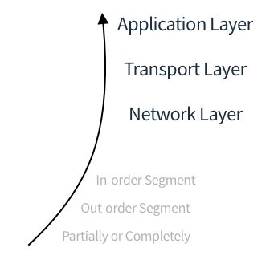

# Chapter 3. Transport Layer (3)

어려워..ㅠ

## 3.5 TCP(Transmission Control Protocol)

...

**TCP Round Trip Time & Timeout**

- 앞선 Principles of Reliable Data Transfer 에서 Ack를 한없이 기다리지 않기 위한 Timer
  - RTT (Round Trip Time) 과 관련되어 있다
- Too short estimation : 불필요한 retransimission 발생
- Too long estimation : Slow reaction to segment loss
- 어떻게 예측가능한가? 
  - Sample RTT 의 평균을 가지고 예측
    - 단 retransimissions time 은 제외하고 계산

$$
DevRTT = (1-β)*DevRTT + β*| SampleRTT - EstimatedRTT |
$$

$$
TimeoutInterval = EstimatedRTT + 4*DevRTT
$$

### Reliable Data Transfer

**TCP Sender Event**

- **Application => receiver**
  - Header에 Seq number 입력 
  - Checksum 계산
  - Timer (가 아직 실행되지 않았다면) 세팅
    - Timer가 세팅되어있다면, 이미 어떤 Segment를 내보냈고, Ack가 오길 기다린다는 상태
- **Timeout**
  - Retransimit Segment
  - Restart Timer
- **Receiver => Application**
  - (3-2_Transport_layer_02 's Image 3-2-8 참고)
  - Update Acked part
  - 새로운 Segment에 대한 Timer 재설정

- **Retransmission scenario**

| Lost ACK                 | Premature Timeout        | Cumulative ACK           |
| ------------------------ | ------------------------ | ------------------------ |
|  |  |  |

- Lost ACK
  - ACK 이 정상적으로 오지 않는 경우 Retransmission 한다.
- Premature timeout
  - timeout이 빨리 동작해서 다시 한 번 data를 보내도, Receiver는 중복된 data는 버리고, ACK만 다시 보내준다.
  - ACK은 cumulative한 속성을 지니고 있으므로 120을 보내준다
- Cumulative ACK
  - 첫 번째 Segment에 대한 ACK가 제대로 전송되지 않더라도, TCP 의 ACK은 Cumulative 하므로, 문제없이 동작.
  - 두 번째 ACK만 잘 도착해도, 앞선 Segment가 잘 전송되었음을 암묵적으로 알 수 있다

**TCP ACK Generation (TCP Receiver Event)**

- Arrival of **In-order** segment & All data **already ACKed**

  - 다음 Segment가 오기까지 기다림
  - 일반적으로 조금만 기다리면 다음 Segment가 온다고 한다

- Arrival of **In-order** segment & One other segment has **ACK pending**

  - 바로 ACK 전송

- Arrival of **out-order** segment

  - 바로 ACK 전송 - 다만 TCP는 NACK을 사용하지 않으므로 Duplicated ACK을 전송

    

- Arrival of **paritially or completely fills gap** segment (in-order segment)

  - 바로 ACK 전송

    

**TCP Fast Retransmit**

- timeout period 가 일반적으로 넉넉한 편이다.
  - 너무 긴 period는 retransmit하는데 오랜 시간을 사용하게 하고 손실이 발생할 수 있음
- duplicatie ACKs 를 통해 Retransmit 하는 것을 Fast Retransmit 이라고 한다.

### Flow Control

**Sender TCP => Receiver TCP로 데이터 흐름**

- Sender TCP 가 보낸 Segment가 네트워크를 통해 전송

  => 여러 레이어를 거쳐 Transport Layer에 도착

  => Segment 를 Receiver TCP **버퍼에 저장**

- Sending Segment 속도가 너무 빠르면 **Buffer overflow 가 생길 것**

**Flow Control**

- 일반적으로 RcvBuffer 는 4096bytes(4KB)

- Space room의 크기를 **rwnd 필드**에 적어서 Sender TCP 에 다시 전송 

  (들어오는 Stream를 위해, 내보내는 Stream에 적어준다)

- Sender는 Buffer overflow가 일어나지 않는 선에서 Segment를 전송

### Connection Management

**Handshake**

데이터를 주고받기 전에 Handshake를 통해 연결. Handshake 과정에서 서로 몇가지 합의하는 부분이 존재

- 내보내는 Stream의 첫 번째 seq number (Sequence number)
- 받는 Stream의 첫 번째 seq number (아마도 ACK)
- Receive buffer size 등등

**2-way handshake**

- TCP의 경우 2-way handshake를 할 경우 문제가 생길 수 있다.
  - Sender 에서 accept signal을 채 기다리지 못하고 새로운 request signal 을 보낼 경우, 빈 sender와 receiver가 connect 될 수 있다.

**3-way handshake**

(다음 시간에 계속....)

---

참고~~!

[Google의 새로운 프로토콜 QUIC](https://www.saturnsoft.net/network/2019/03/21/quic-http3-1/)

