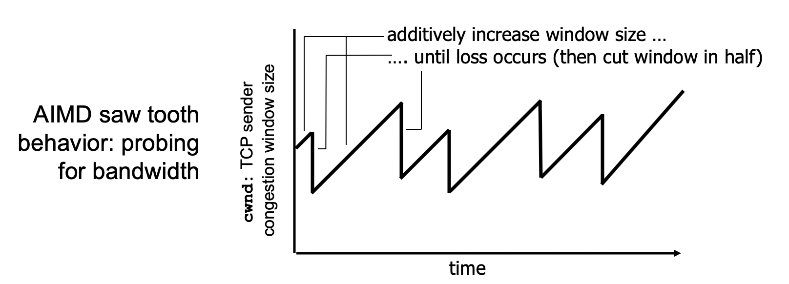

# Chapter 3. Transport Layer (4)


이전 강의에 이어서...


### 2-way handshake failure


> 서버의 입장에서 클라이언트로부터 최초에 받은 request만으로는 '현재' 클라이언트가 살아있다는 것을 확신할 수 없음


### 3-way handshake


서버가 보낸 response에 대한 ACK이 왔기 때문에 현재 클라이언트가 살아있다고 판단할 수 있음!

- SYNbit = 1 : connection을 맺고 싶다.
- ACKbit = 1 : ACKnum이 있다.

- SYN msg에는 데이터 대신 Client가 사용하고 싶은 initial seqNum을 담아서 보냄

- SYNACK에는 ACKnum field에 x+1의 값을 넣어서 Client가 원하는 seqNum을 사용해도 됨을 표시
- 마지막 단계에서는 Client 측의 application data가 담겨서 나갈 수 있음


### FSM


#### Server (Gold) 

> 1. Application이 실행되면 welcomeSocket(Doorsocket)을 create
> 2. Listen 상태에서 Client의 msg를 기다림
> 3. Msg가 오면 해당 Client와 통신할 수 있는 새로운 소켓을 열고, SYN msg를 보냄
> 4. Client로부터 다시 ACK을 받으면 Establish 상태로 넘어감

#### Client (Silver)

> 1. Server에 SYN msg를 보내고 응답을 기다림
> 2. Server로부터 ACKnum을 담은 응답이 오면 최초의 Data를 담은 msg를 전송


### Closing a connection

Server와 Client 양측 모두 FIN seg에 FIN bit = 1로 설정해서 전송하여 connection close를 요청할 수 있음

상대방의 FIN seg에 대해서 ACK을 보내며 함께 자신의 FIN seg도 보낼 수 있음


> Closing은 독립적으로 일어나는 일이기 때문에 우연히 Server와 Client가 동시에 FIN seg를 보낼 수 있음
>
> 역시 그렇기 때문에 상대방이 FIN seg 보냈다고 해도 자신은 계속해서 data를 보낼 수 있음


- Segment lifetime (세그먼트가 만들어진 이후 인터넷에서 살아서 돌아다닐 수 있는 max time)
  - 만약 마지막 ACKnum이 유실된다면, Server측에서 Retransmit을 할 수 있음
  - 이 때 Client가 이미 닫혀버린다면, Server는 시스템이 정한 만큼 계속해서 Retansmit msg를 보내게 됨


---


## Principles of Congestion Congrol (3.6)


#### Congestion

- 네트워크가 허용하는 양보다 더 많은 데이터를 Source들이 밀어넣어서 생기게 됨
- 현상
  - Long delays (Queueing in router buffers)
  - Lost packets (Buffer overflow at routers)


> 실제로는 retransmit data가 생기므로 람다in보다 더 큰 데이터가 발생


어느 정도의 retransmission 증가까지는 goodput(throughput 중에서도 반복적으로 오는 data를 제외한 실제 필요한 데이터)이 증가하지만, 너무 많은 데이터가 전송되면 거의 0으로 수렴하게 됨

- Unneeded Retransmissions: 중복 데이터 증가
- Upstream transmission capacity used for dropped packet is wasted


### Approaches towards congestion control


1. end-end congestion control
   - 실제로 congestion이 발생하는 위치는 network 내부임에도 불구하고 network이 외부에 "지금 congestion이 발생했으니 ratio를 낮추라"고 요청을 보내지 않음
   - End system이 Loss나 Delay로 congestion 상황을 감지하고 조치를 취함
   - TCP는 인터넷의 프로토콜이므로, 패킷을 전달하는 것을 제외한 모든 복잡한 프로세스는 Edge에 맡기게 됨
2. network-assisted congestion control
   - Router가 가장 먼저 congestion을 감지하고 end system으로 알리게 됨
   - Single bit를 이용해서 congestion 상황을 알리거나, 명시적인 rate를 전달하기도 함


#### Approach




- 사용 가능한 선의 bandwidth를 찾기 위해 점진적으로 cwnd를 증가시켜나감 (additive increase)
- loss가 발생할 경우 빠르게 reaction하기 위해 급격히 반으로 줄여버림 (multiplicative decrease)

> RTT마다 TCP는 대략적으로 보면 1 MSS(Maximum segment size) 만큼씩 congestion window size를 높여감RWND가 flow control을 위해 사용되는 것이었다면, cwnd는 congestion control을 위해 사용되는 것


[Details]


- 항상 **LastByteSent - LastByteAcked <= min { cwnd, rwnd }** 를 유지

- cwnd는 시간에 따라 네트워크의 congestion이 빠르게 변하므로 매우 다이나믹함

- rwnd는 Receiver의 receive buffer size에 의해 결정

> cwnd에 의해서 sending rate이 결정된다고 가정!

- 한 RTT동안 cwnd만큼의 byte를 연속적으로 내보낼 수 있음
- 그러고 나서는 stop해야함. RTT시간이 지나야 ACK이 돌아올 것이므로!


#### TCP Slow Start


- 내보낸 segment에 대한 ACK 하나가 들어올 때마다 cwnd를 하나씩 늘려나감
- 처음에는 적게 내보내지만, 결국 Exponential하게 증가하게 됨


#### TCP Congestion Avoidance

어느 순간부터는 cwnd를 증가시키는 것을 조심해야함 (cwnd가 충분히 크다면)

네트워크 상황에 대한 정보가 없기 때문에 처음에는, 초기에는 OS에 의해 정해진 default value로 결정지어짐

> ssthresh

Rate를 늘려나가다가 loss를 경험하게 되면, 그 순간의 value는 너무 크다는 의미이므로 ssthresh를 cwnd/2로 설정함

- slow start가 아닌 congestion avoidance 실행

- cwnd를 모든 RTT에서 하나씩만 증가시켜나감

- ACK이 들어올 때마다 MSS/cwnd 만큼 증가 (한 RTT동안 ACK이 cwnd개 들어오므로!)

  > 한 RTT동안 1MSS/cwnd * cwnd(ACK 개수) = 1MSS만큼 증가


정리하자면...

```python
if cwnd < ssthresh: 
	slow start phase
  # RTT마다 cwnd를 두 배로 증가
else:
	congestion avoidance phase
  # RTT마다 cwnd를 하나씩 증가
```


### TCP: detecting, reacting to loss


#### Loss indication

1. **Timeout**
   - 아예 꽉 막힘!
   - ssthresh는 반이 되었는데, cwnd는 1이 되므로 빨리빨리 증가하는 slow start! (굉장한 모순적 네이밍)
2. **3 duplicate ACKs** (TCP RENO)
   - Loss가 일어난 부분을 제외하고는 데이터가 흐르고 있음 - ACK이 전송되고 있으므로!
   - ssthresh도 반이고, 새로운 cwnd도 반이므로 ssthresh와 cwnd의 값이 같으므로 congestion avoidance

> TCP Tahoe: loss가 감지되면 무조건 cwnd를 1MSS로 줄여버림 (최소값)
>
> TCP RENO: timeout에 비해 3 duplicate ACKs는 덜 심각한 상황임! 그러므로 절반으로만 줄임


> loss가 발생한 시점의 ssthresh가 12이므로, 절반인 6으로 설정


### TCP Performance


#### Throughput

만약 RTT에서 cwnd가 K라면 K/RTT가 throughput이 됨

W: Loss가 발생하는 지점


- 기술 발전에 따라 pipe가 길어지고, 뚱뚱해지면 window를 증가시켜서 throughput을 더 효율적으로 활용해야함

- 하지만, TCP는 loss가 발생하는 순간 한 RTT동안 pipe 안쪽에 단 하나만의 데이터를 넣고 있거나, rate를 절반으로 줄이기 때문에, 목표하고자 하는 throughput을 달성하기 위해서는 굉장히 작은 loss rate을 달성해야함


#### Fairness


- 처음 시작할 때 서로 다른 share를 가지고 있더라도, 여러 번의 loss를 거치면서 점차 fair하게 변화함
- 하지만 bottleneck으로부터의 거리가 다르다면, 가까운 쪽에서 더 빠르게 react하므로 unfair

- UDPsms loss를 고려하지 않고 계속해서 데이터를 뿜어내므로 TCP의 적!
- Parallel TCP 를 여러 개 연결한다면, 하나만 연결한 application이 손해를 보게 됨