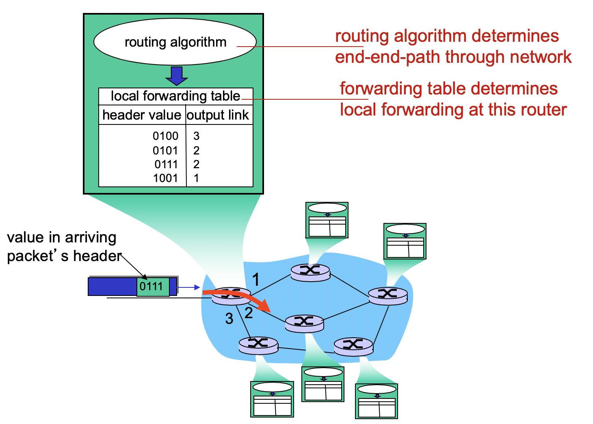
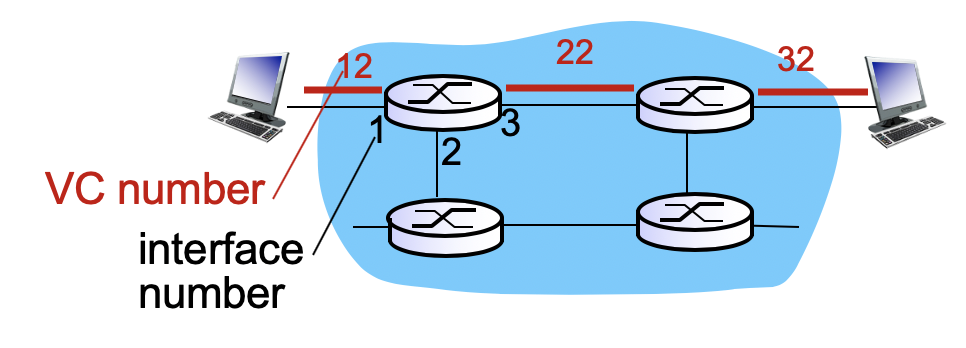
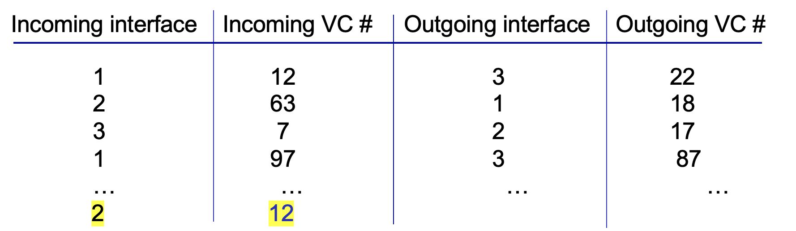
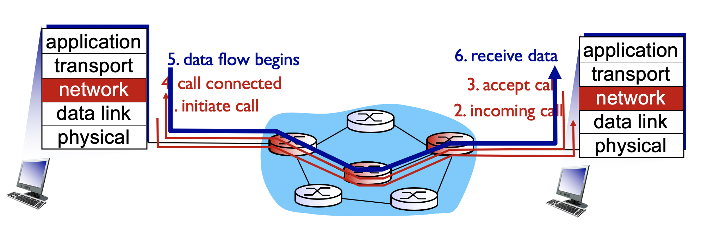
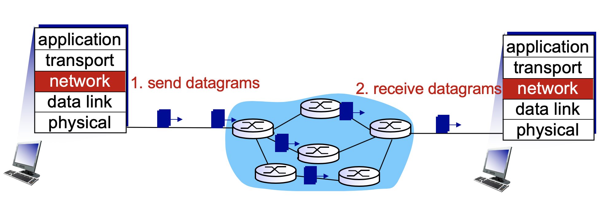
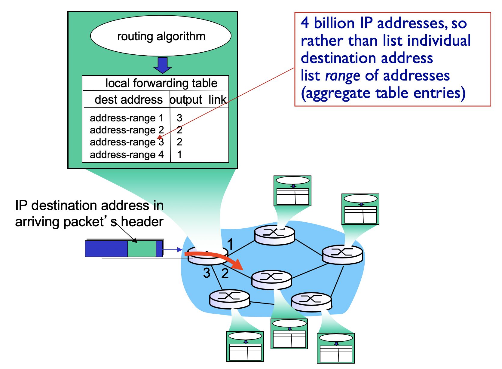

# Chapter 4: Network Layer

## 4.1 Introduction

### Network layer

transport 계층의 segment를 host to host delivery 해주는 것이 목적

네트워크 계층 헤더를 붙여서 segment를 encapsulate 해서 datagrams를 생성

- host, router 모두에 network layer protocol이 탑재됨
  - host: routing 기능이 약함. 단순히 우리의 subnet을 인터넷에 연결해주는 gateway router가 누구인지를 찾아서, local network의 목적지가 아니라면 무조건 거기로만 연결해줌
  - router: 모든 IP datagram의 헤더를 확인

### Two key network-layer functions

1. Forwarding
   - 라우팅에서 계산한 경로 정보를(forwarding table) 활용해서 정확한 router output으로 packet을 전달하는 것
2. Routing
   - source로부터 dest로 가는 route를 결정해주는 것
   - routing algorithm을 실행해서, end-to-end path를 forwarding table에 저장해둠

## 4.2 Virtual circuit and Datagram networks

> 1장에서 네트워크 종류가 circuit switching / packet switching network이 있다고 했음
>
> 현재는 packet switching network에 관한 내용인데, 이 중에서 vc는 circuit-like-behavior 흉내낸 모델

**Transport-layer service에서도 비슷한 개념이 등장했었지만, 다소 차이가 존재함**

>  TCP: connection-oriented

> UDP: connectionless

- Transport 계층
  - 양 끝단(Sender / Receiver process) 에서 connectionless/connection-oriented service를 implement
  - process-to-process service
  - 사용자가 TCP/UDP 선택 가능

- Network 계층 

  - network core에 있는 router들과 end system들이 협력해서 적용!

  - host-to-host service
  - 사용자가 Datagram / Virtual-circuit 선택 불가능

#### Virtual-circuit

> 네트워크 단의 Conection oriented service 제공

- call setup
  - 경로가 결정됨
  - Sender 측에서 어떠한 목적지로 vc setup을 하고 싶은지 네트워크로 요청
  - 네트워크는 call setup에 있는 목적지 주소로 route
- 각 패킷들은 VC identifier를 지님
- 경로에 속하는 모든 라우터는 각각의 passing connection의 'State'를 저장
- bandwidth, buffer와 같은 리소스들이 VC에 할당될 수도 있음

- teardown

**Implementation requirements**

1. 경로
2. VC numbers - 경로상의 각 링크마다 하나의 번호 부여
3. 위의 두 정보를 forwarding tables에 저장

- Datagram의 헤더에 목적지 주소를 적기보다는 VC numbers를 적게 됨
- 해당 VC number는 각 link에서 환승할 때마다 바꾸게 됨 (Switching)
  - 새로운 VC number는 forwarding table에서 획득

> Why?

- 처음부터 끝까지 경로상에서 동일한 VC 번호를 사용하는 경우 VC번호가 더 많이 필요함
  - 각 개별 라우터를 지나는 VC에 비해서 경로상 모든 링크를 지나는 VC의 개수가 훨씬 많기 때문에 unique하게 만들기 위해서는 훨씬 많은 bit이 필요함

- 전체 경로의 VC번호를 unique하게 유지하기 위해서는 모든 라우터들이 모두 합의해야함! (Control overhead)
  - Switching하게 되면 각 라우터별로 incoming VC number만 unique하게 지정해주면 됨

**Signaling protocols**

setup, maintain, teardown 을 위해서 반드시 router간의 signaling을 위한 규약이 필요함

> ex) ATM, frame-relay, X.25 (전화회사들)
>
> 현대 인터넷에서는 사용되지 않고 있음!

> 복잡...

#### Datagram network

>  네트워크 단의 Connectionless service 제공

- call setup이 존재하지 않음
- 라우터별로 end-to-end connection에 대한 state가 없음
  - 네트워크 레벨의 "connection" 개념이 없음
- 패킷은 목적지 호스트 주소를 이용해서 forwarding 됨!

> 간단!

- 40억개의 IP주소를 테이블로 두게 되면 그 자체로도 용량이 크고, lookup time이 길어지게 됨

- 때문에 Destination address를 range별로 묶어서 table에 저장해둠

  > 서울에서 김해 갈 때 표지판에 각 경로의 자세한 위치를 표시하기보다는, '부산'으로 표시된 고속도로 경로를 우선적으로 찾아간 다음, '김해' 표지판을 찾는 것과 비슷하다고 보면 됨!

| Internet (datagram)                                          | ATM (VC)                                                     |
| ------------------------------------------------------------ | ------------------------------------------------------------ |
| 네트워크 내부에서 하는 일을 최소화하고 빠르게 데이터를 전송하는 것에 집중, 똑똑한 end system들이 존재하기 때문에 strict한 조건이 필요하지 않음 | end system이 굉장히 바보같기 때문에 complex한 일을 네트워크가 해주고, 사용자들에게 일관된 사용 경험을 제공하기 위해 strict한 조건이 존재 |
| 인터넷은 무료이기 때문에 error 발생의 책임을 네트워크가 지지 않음 end system들이 | 돈을 내고 사용하는 서비스들이기 때문에 error가 발생하는 것을 최소화하려는 목적이 있음 |

