# Chapter4. Network Layer - 6 & 7

임채민 수면부족으로 사망..!

## Hierarchical Routing

### 1. Autonomous System

저번시간에 배웠던 Routing Algorithm은 사실...!! 네트워크를 너무 ~~flat하게~~ 만만하게 봤던 것. 
실제 네트워크는 양도 많고 여러 기관에서 관리하는 서브넷들이 존재.

- scale - with 600 million destination => destination 이 너무 많아서 forwarding table 로 만들 수 없음..

- administrative autonomy - network admin control in its own network => 라우터 정보들을 한데 모으기 힘듦..

위와 같은 문제 때문에 실제 네트워크 라우팅은 지역 & 기관별로 라우터들의 집합을 나눠서 관리하는 Hierarchical Routing 시스템을 이용한다. 이때 특정지역 & 특정 기관에 속해있는 라우터 집합을 Autonomous System(AS) 라고 한다.

Hierarchical Routing 은 크게 두 라우팅 프로토콜을 가지고 있다. 그리고 이 둘을 합쳐 Forwarding table 을 구성하게 된다. 

- **Intra-AS routing protocol(=algorithm)** - 한 AS 안에서 이뤄지는 라우팅을 위한 프로토콜
- **Inter-AS routing protocol(=algorithm)** - 다른 AS 끼리 이뤄지는 라우팅을 위한 프로토콜

각 AS들을 이어주는 라우터들을 **Gateway Router** 라고 한다.

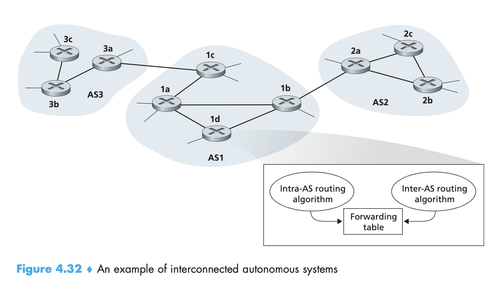

### 2. Inter-AS routing protocal(=algorithm) task

고렇다면 Inter-AS routing 은 어떻게 동작하는가??

<1d에서 라우팅이 시작했다고 가정>

1. Gateway Router 를 통해 AS끼리 정보를 주고받는다.

2. **Learn** - AS2, AS3을 통해 어떤 Destination에 도달할 수 있는지를 학습
3. **Propagate** - 위 정보를 AS1의 모든 라우터에게 전달

일련의 과정이 모두 Inter-AS routing이 하는 역할

### 3. Choose among multiple ASes

<1d에서 라우팅이 시작했다고 가정>

X 에 도달할 수 있는 방법이 AS2, AS3 모두 존재할 때, 

- 1d => 1c => AS3 => X
- 1d => 1b => AS2 => X

**두 방법 중 하나를 선택하는 것도 Inter-AS routing protocol의 역할.**

선택하는 policy로 hot potato routing 을 사용한다고 한다. 물론 더 복잡하지만 뒤에 나오므로 간단히 넘어가쟈. 그냥 AS1에서 가장 shortest path인 라우터로 라우팅을 하는 방법. 한 AS 안에서는 최대한 적은 리소스를 소모하면서 라우팅을 하는 방법.

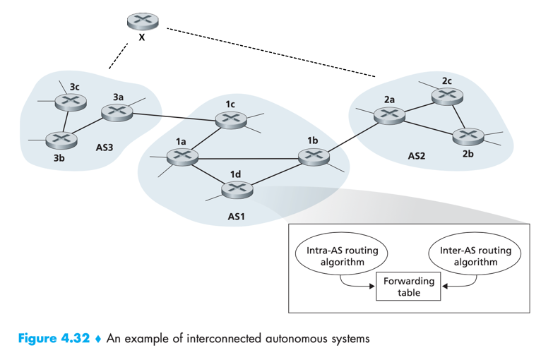

## Routing in the Internet

인터넷에 사용되는 라우팅들을 알아보도록 하자..!

### 1. Infra-AS Routing

IGP (Interior Gateway Protocol) 라고도 한다.

- **RIP** (Routing Information Protocol) - 가장 초기 방법
- **OSPF** (Open Shortest Path First) - 현재 가장 많이 사용되는 방법

- IGRP (Interior Gateway Routing Protocol) - Cisco 회사 고유 프로토콜

#### 1-1. RIP

**특징**

- BSD-UNIX 운영체제에 포함되어 배포됨.
- **Distance Vector Algorithm** 기반
  - Distance Metrics - 각 link cost를 1로 가정. 최대 15 (16부터는 INF로 처리)
  - Distacne Vector exchange neighbors (aka advertisement)
  - Subnet 정보를 교환 
    - 최대 25개의 destination subnets 정보만 교환
- **소규모, Homogeneous 한 네트워크에 적합**하다.

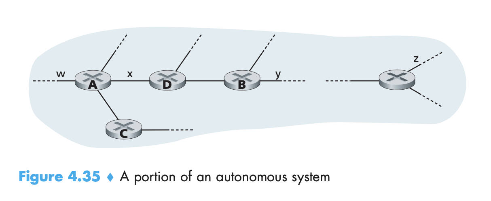

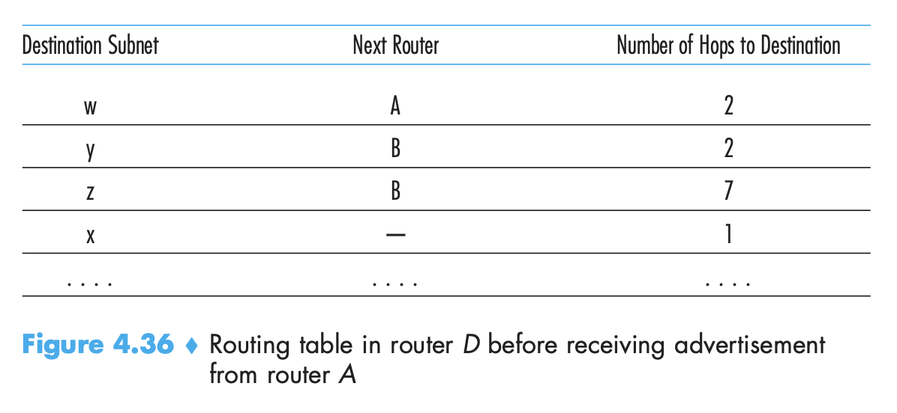

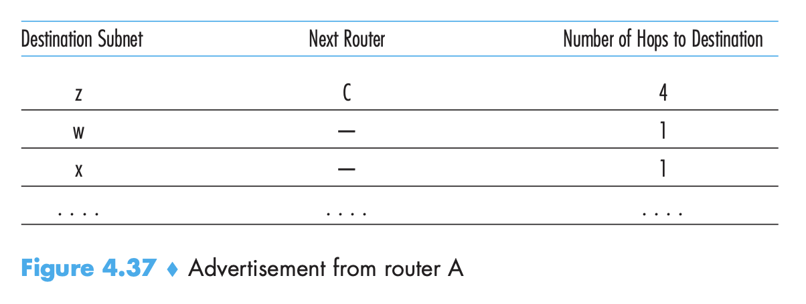

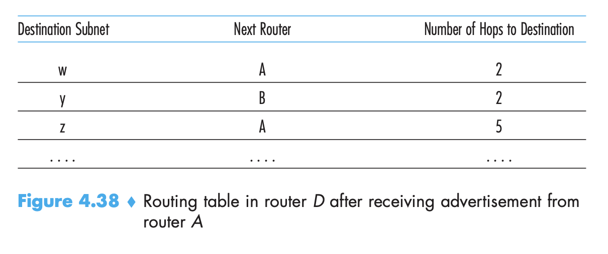

**Link failure & recovery**

- neighbor로부터 advertisement가 180초 동안 없다면(원랜 30초마다 와야함), 링크 제거
- 새로운 advertisements(링크가 제거된 테이블 정보)를 neighbor에게 전달 => propagation

- poison reverse을 사용해서 ping-pong loop 방지

**Table Processing**

- 앞서 말했듯, UNIX 운영체제에 포함되어 배포됨.
  - Application Layer 에서 실행된다는 의미. `route-d` 라고 부른다.
- 운영체제 안에서 계속 실행되면서, advertisement를 만들고, UDP 프로토콜을 이용하여 Network Layer로 전달, Forwarding Table을 업데이트 하면서 라우팅.

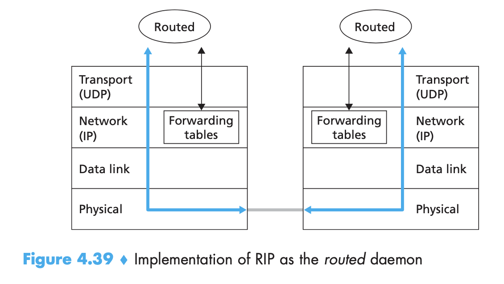

#### 1-2. OSPF

**특징**

- Open = public available
- RFC에 포함되어 있음
- **Link State Algorithm** 기반
  - 각 노드를 이용하여 Topology map 생성 => 그래프화
  - 자신을 기준으로 Dijkstra algorithm 수행
  - Exchange advertisement
    - neighbor 갯수 만큼의 정보만 교환
    - 하나의 advertisement 크기는 작을 수 있지만, 네트워크 전체로 전달되어야 하므로 전달과정이 더 많을 수 있음.

- IP 바로 위에 구현되어 있음 => TCP / UDP를 통해 전달될 필요가 없다.

**RIP에 비해 발전된 점**

- RIP보다 **규모가 큰 AS에도 적용 가능**
- 다양한 link cost 사용 가능, 단! 다수의 link cost를 이용한다면 각각 cost에 따른 link state가 각각 advertisement 로 전달되어야한다. 경로계산도 각 cost마다 따로 해줘야 함.
  - delay
  - bandwidth
  - cost (비용) ...
- Multicast routing 지원
  - MOSPF(Multicast OSPF)
  - OSPF와 같은 topology data 사용
- 보안적인 문제도 더 좋아졌다.

**Hierarchical OSPF**

- OSPF도 역시 규모가 커지면, node와 link가 많아지고 advertisement packet이 많아지므로 계층을 나눠서 관리
- OSPF를 **Area**로 분할 / Link State Broadcasting (advertisement) 는 이 area 안에서만 수행
  - 전체 AS 규모가 늘어나도 area 규모를 고정시키면 broadcasting 부담을 줄일 수 있음
- Area 외부의 서브넷에 대한 정보를 알기 위해, **Area Border Router** 를 설정
  - 우리 area 안에는 어떤 서브넷들이 있고, 이 서브넷들이 area border router로 부터 얼마나 떨어져있다는 정보 교환
- Area 들을 연결해주기 위한 **Backbone Router** 설정
  - backbone router 끼리 Link State Broadcasting 수행
  - backbone에는 area border router도 포함됨
- Boundary Router = Gateway

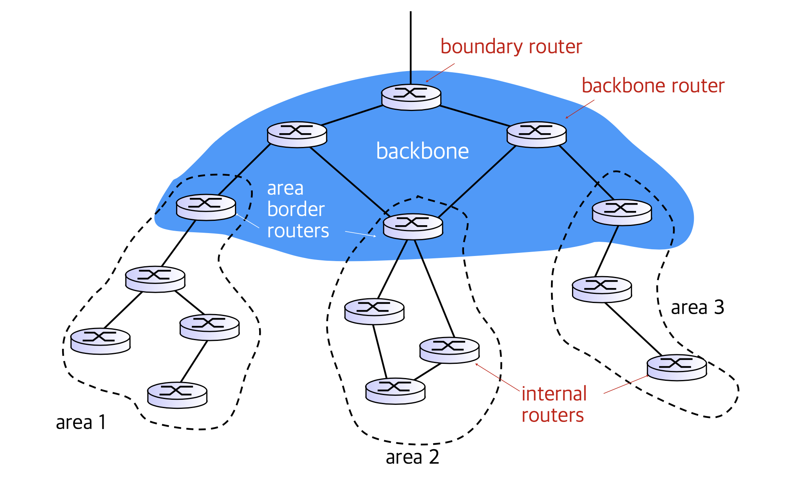

### 2. Inter-AS Routing - BGP(Border Gateway Protocol)

각 AS 마다 사용하는 프로토콜이 다르면 안되므로 하나의 프로토콜로 통일해서 사용. 단 과정에 따라 다른 프로토콜 사용

- eBGP - for learn. 인접한 AS로 부터 접근가능한 서브넷들의 정보를 얻어오는 과정에 대한 프로토콜
- iBGP - for propagation. 얻어온 정보를 AS-internal Router에게 전달하는 과정에 대한 프로토콜

라우팅 선택시, Intra-AS Routing과는 달리 **Policy**를 선택의 중요한 요소로 삼는다.

#### 2-1. BGP Basic

- 이웃한 두 BGP들은 semi-permanent TCP connection을 맺는다.
  - 이 connection을 통해 advertisement를 교환
  - advertisement 를 교환한다는 의미는, 언젠가 필요하다면 연결하고자 하는 서브넷으로 forwarding 을 약속(promise) 한다는 의미.

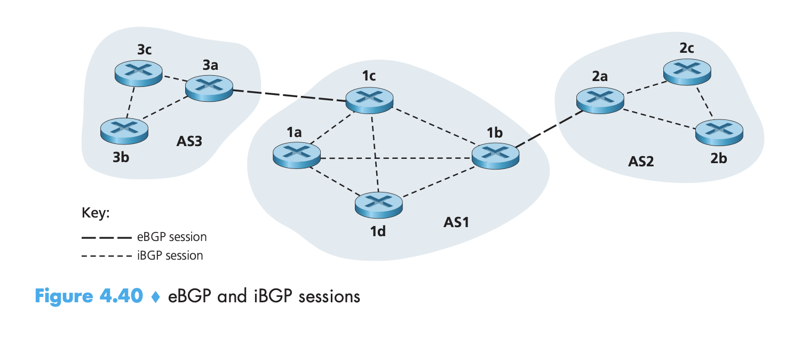

#### 2-2. BGP Route & Path Attribute

- BGP Route는 prefix와 attributes로 구성된다
  - prefix - 목적지 정보 prefix
    eg) 138.16.42..22
  - attribute - 목적지에 이르기 위한 경로정보
    - AS-PATH - subnet prefix 까지 가는데 거쳐야 하는 AS들의 리스트 
      eg) AS3, AS131 ...
    - NEXT-HOP - Gateway router. 경우에 따라 multiple gateway routing 관계일 수 있으므로 필요
      eg) 201.44.17.125
- **Import Policy**
  - 전달되는 advertisement 를 받을지 말지에 대한 정책

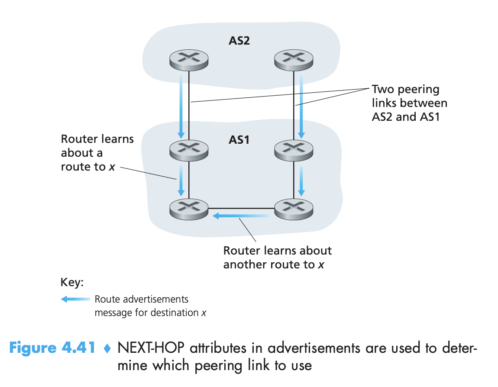

#### 2-3. BGP Route Selection

**경로 선택 우선순위**

1. local preference value attribute (=policy)
2. shortest AS-PATH
3. closest NEXT-HOP router (=hot potato routing)

4. additional criteria ...

#### 2-4. BGP Messages

이웃한 BGP 끼리 맺는 semi-permanent TCP connection 에서 전달되는 메세지 구성.

- OPEN
  - Open TCP connection
- UPDATE
  - 새로운 경로정보가 생기면 전달 
- KEEPALIVE
  - UPDATE 할 내용이 없을때, TCP connection이 끊기지 않도록 KEEPALIVE를 정기적으로 전달
  - OPEN 메세지를 받은 BGP는 KEEPALIVE 메세지로 ACKs 전달
- NOTIFICATION
  - 오류 리포트
  - Close TCP connection

#### 2-5. BGP Routing Policy

advertisement 를 전달할지 말지를 결정하는 policy

- Provider > Customer / Provider > Provider 로 전달된 advertisement 는 다시 Provider로 전달되지 않는다.
  - B > X advertisement 를 X > C 로 전달하지 않음
  - C > X advertisement 를 X > B 로 전달하지 않음
- advertisement를 전달한다는 것은 곧, forwarding 해준다는 것과 같으므로, X 입장에서 B, C가 X를 거쳐 C, B로 라우팅되는걸 원하지 않으므로 전달하지 않는다. 

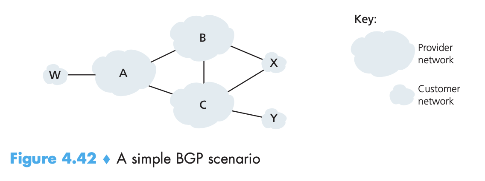

### 3. Intra-AS vs Inter-AS

|             | Intra-AS Routing                                             | Inter-AS Routing                                             |
| ----------- | ------------------------------------------------------------ | ------------------------------------------------------------ |
| Policy      | policy 필요 없움. 성능만 신경쓰면  됨                   | Route 간 트래픽 컨트롤 등을 위해  Policy 필요           |
| Scale       | 둘 모두 hierarchical routing 을 적용하면 table size, update tarffic을 줄일 수 있음 | 둘 모두 hierarchical routing 을 적용하면 table size, update tarffic을 줄일 수 있음 |
| Performance | 성능이 가장 중요                                             | policy에 따라 결정됨                                         |

## Broadcast and multicast routing

> Broadcast - 한 source 에서 보내는 데이터를 한 네트워크 상 모든 destination 에서 받는 것
> Multicast - 한 source 가 보내는 데이터를 여러 destination 에서 받는 것

이 두 기능은 별도의 과정 없이 uni-casting 을 통해 구현 가능. source 근처에서 stress 가 높아짐.
만약 broadcast, multicast 를 위한 정보를 별도로 가지고 있다면, 훨씬 더 효율적으로 전달 가능할 것.

하지만..! source host가 네트워크 속 모든 destination 주소를 알고있어야 한다는 문제점 존재! 두둥..!

=> uni-cast를 통해 구현될 수 있지만 매!우! 비효율적이다

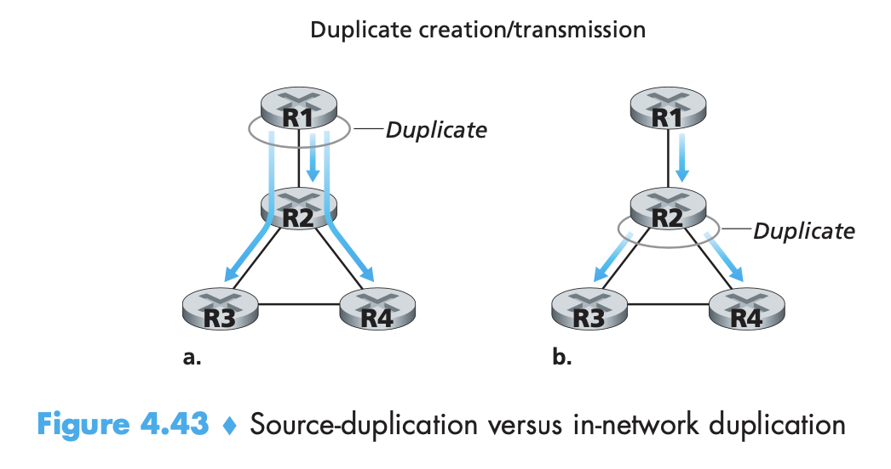

### 1. BroadCast Algorithm

network topology 만 있으면 구현 가능

#### 1-1. Flooding

**개념**

- 특정 노드가 broadcast 할 데이터(패킷)을 받으면, 이 데이터를 연결되어있는 모든 neighbor에게 전달하는 방법

**문제점**

- cycle - 전달했던 데이터가 돌고돌고돌아 다시 나에게로 돌아오는 현상
- broadcast storm - 앞선 cycle 문제로 돌고돌고돌아 다시 돌아온 데이터를 또 다시 내보내면서 생기는 현상

#### 1-2. Controlled Flooding

**개념**

- Flooding 의 문제점을 개선하고자, 처음 받은 데이터만 broadcast하거나, shortest path를 통해 들어온 데이터만 broadcast 하는 방법.
  - 특히 후자를 reverse path forwarding 라고 한다.

#### 1-3. Spanning tree

**개념**

- 그래프의 모든 노드를 단 한번씩 지나는 트리를 만들고 이 트리를 따라서 데이터 전달.
- 가장 효율적인 방법

**문제점**

- Spanning tree 를 그리는거부터 어려워.. 
  => Spanning tree를 만들기 어려워서 대략적으로 특징만 딴 알고리즘이 reverse path forwarding.

### 2. Multicast Algorithm

network topology 와 더불어 membership info 도 같이 알아야 함

- membership info - 특정 라우터에 연결되어 있는 member 정보

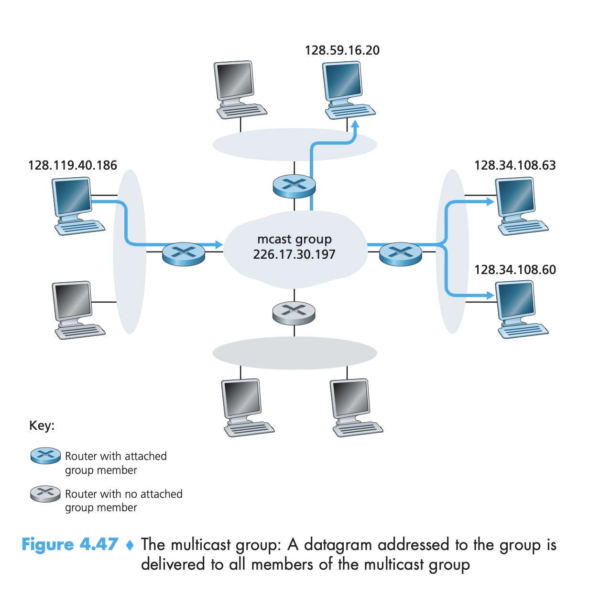

#### 2-1. Approaches

- source-based tree - one tree per source
  - shortest path tree
  - reverse path forwrading
- group-shared tree - group uses one tree
  - minimal spanning tree (Steiner). NP Hard
  - **center-based tree**

#### 2-2. Center-based tree

Group-shared tree를 그리되 적당히 그리는 방법
세션에 참여하고 빠져나가는 경우등 다이나믹한 상황에서도 잘 동작하고, 큰 규모의 네트워크에서 사용하기 적합한 방법

**방법**

- 임의의 center node 설정 - 모든 네트워크는 센터 노드를 알고 있는 상황
- edge router 들은 center node 에게 join-msg 를 전달
  - 완전 최적은 아님
- 전달받은 join-msg를 통해 트리 업데이트

#### 2-3. Source-based tree

적은 규모의 네트워크에서 사용하기 적합

