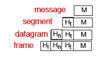
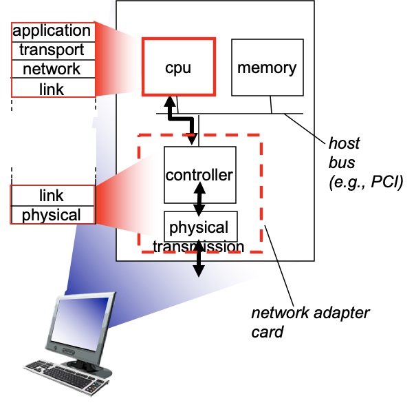
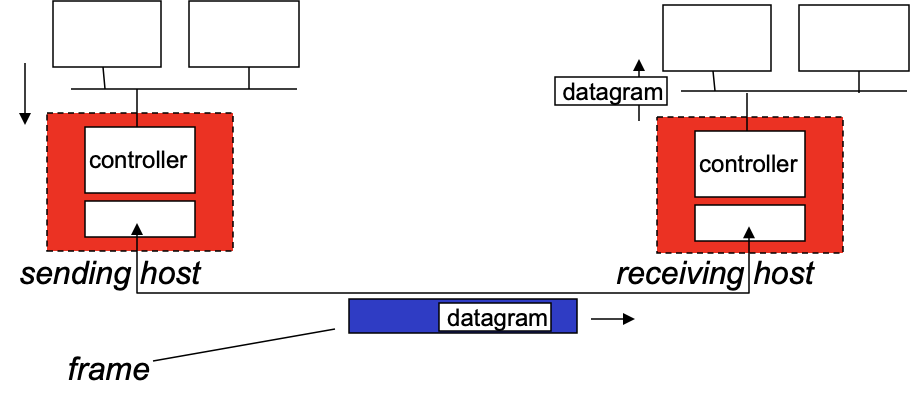
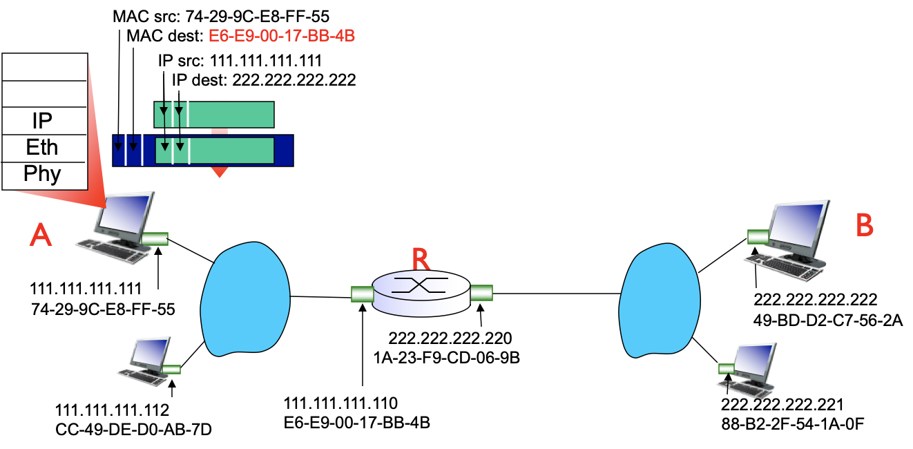

# Chapter 5. Link Layer

## Introduction

### 관련 용어

- 노드: 호스트, 라우터

- 링크: 인접 노드 간 커뮤니케이션 채널

  - wired links
  - wireless links
  - LANs

- 프레임(frame): layer-2 packet. encapsulated datagram. 데이터그램에 헤더, 트레일러 더해서 encapsulate 한 것

  ​	▼ encapsulated datagram

  

### 역할

어떤 노드에서 "물리적으로" 인접한 다른 노드로 링크를 통해 데이터그램을 전송하는 역할을 담당

- 프레이밍
  - 프레이밍 = header + datagram + trailer => encapsulate
  - 프레임의 헤더에 MAC address를 적어 source, destination을 식별

- 인접 노드 간 reliable delivery
- 흐름 제어
  - 안전한 송신 노드와 수신 노드 사이의 페이싱(pacing)
- 에러 탐지
  - 신호 감쇠, 노이즈 등으로 에러 유발됨
  - 수신자가 에러 탐지 => 재전송을 위해 시그널을 보내거나 or frame을 버림
- 에러 수정
  - 수신자가 에러를 식별하고, 재전송을 위해 bit error를 수정
- half-duplex and full duplex
  - half-duplex: 송수신 가능, 단 한 번에 하나만. 두 노드가 통신하면서 동시에 송신은 불가
  - full-duplex: 송수신이 동시에 가능. 반은 보내는 쪽, 반은 받는 쪽으로 사용. 무선은 full-duplex 불가능

### 위치

- 각 호스트의 "어댑터" aka NIC(Network Interface Card)나 칩에 내장
  - 이더넷 카드, 802.11 카드; 이더넷 칩셋...
  - 내장된 링크, physical layer

- 호스트 시스템 버스에 첨부됨
- 하드웨어, 소프트웨어, 펌웨어의 콤비네이션

### 통신 방법

| 보내는 쪽                           | 받는 쪽                                    |
| ----------------------------------- | ------------------------------------------ |
| 데이터그램을 프레임으로 encapculate | 데이터그램 추출해서 상위 레이어로 올려보냄 |

## Multiple access links, protocols

### 링크의 두 가지 타입

| point-to-point                                               | broadcast (shared wire or medium)                       |
| ------------------------------------------------------------ | ------------------------------------------------------------ |
| - 전화 접속을 위한 PPP(Point to Point Protocol) - 이더넷 스위치 - 호스트 간  ptp link | - 구식 이더넷 - upstream [HFC]([https://ko.wikipedia.org/wiki/%EA%B4%91%EB%8F%99%EC%B6%95_%ED%98%BC%ED%95%A9%EB%A7%9D](https://ko.wikipedia.org/wiki/광동축_혼합망)) - 802.11 wireless LAN  |

### Multiple access protocols

- 한 채널에서 여러 개의 노드가 한 번에 송신을 하면 수신자에선 간섭(interference)이 발생
- 간섭 => 수신자가 각 시그널을 구분해내지 못하면 **충돌**(collision)
- 이를 방지하기 위한 것이 multiple access control
  - 한 번에 하나의 노드만 송신하도록 컨트롤해서 충돌을 줄이는 게 목적
  - 노드 간 채널을 공유하는 방식을 결정하는 분산 알고리즘 = multiple access protocol

### MAC protocols: taxonomy(분류)

- channel partitioning
  - 채널을 작은 조각으로 나누어 노드에 채널 조각을 독점 할당
  - 로드가 많으면 꽤 효율적이고 공평함
  - 로드가 적으면 낭비가 됨. 여러 개의 노드 중 나 하나만 active해도 무조건 1/N => 비효율적
  - TMDA(Time Division Multiple Access)
  - FDMA(Frequency Division Multiple Access)
- random access
  - 나눠지지 않는 채널(single shared broadcast channel)에서 사용하는 프로토콜
  - 개별 노드가 채널을 완전히 사용할 수 있음 => 로드가 적을 때 효율적
  - 그러나 로드가 많으면 충돌 가능성 ↑  => 충돌 허용. 대신 충돌이 나면 복구(ex. delay - retransmition을 한다든지...)
  - [(pure) ALOHA](https://en.wikipedia.org/wiki/ALOHAnet#Pure_ALOHA)
  - [slotted ALOHA](https://en.wikipedia.org/wiki/ALOHAnet#Slotted_ALOHA)
  - CSMA, CSMA/CD, CSMA/CA
- taking turns
  - polling: 주(master)-종(slave) 노드가 있음. master에서 slaves 초대. slave는 master가 자신을 선택할 때만 전송 기회를 얻음
  - token passing : master 없이 노드들 사이에서 토큰을 돌리면서, 토큰 받은 노드가 전송 기회를 얻음
  - bluetooth, FDDI, token ring

## LANs

### Address

- IP Address
  - 32bit (8 bit * 4)
  - 전세계에서 유일한 나만의 IP Address
  - 위치와 바인딩됨 (= IP로 위치 추적 가능)
  - (주민등록번호 같은 것)
- MAC Address (Media Access Control Address)
  - 48bit
  - link layer에서 통신을 위해 네트워크 인터페이스에 할당한 고유 식별자 => (물리적인) 네트워크 주소
  - 모든 디바이스는 MAC 주소를 가짐
  - n1 → n2 노드로 데이터그램을 송신한다 = 물리적 링크에 싣는다 = Frame Header에 보내는 이, 받는 이 MAC 주소 적어줘야 함
  - (집 주소 같은 것)

### ARP: address resolution protocol

[에이알피 / 알프]

- IP : MAC address mapping

- TTL (Time To Live) - 엔트리 유지 시간. 보통 20분

- plug-and-play : 네트워크에 연결하는 순간 자동으로 동기화 됨

  

- ARP table: LAN에 있는 노드 각각 테이블을 갖고 있음

- n1 → ES(이더넷 스위치) → n2

  1. ARP query를 broadcast
     1. n2의 MAC 주소 모르니까 IP 주소만 제대로 적음
     2. MAC 주소는 FF-FF-FF-FF-FF-FF
  2. ES에 연결된 모든 노드가 이를 받음
  3. (n2) 자기 IP 주소다? => 자기 MAC 주소 채워서 응답 (unicast)
  4. (통상) 20분 간 n1이 n2의 MAC 주소를 ARP table에 '캐싱'
  5. n2도 APR query를 받으면 n1의 MAC 주소 캐싱

  

- dest IP 주소를 보니 외부 네트워크 => 프레임에 router의 MAC 주소 적어서 보냄
- router가 프레임 떼고 IP 주소 확인해서 포워딩
