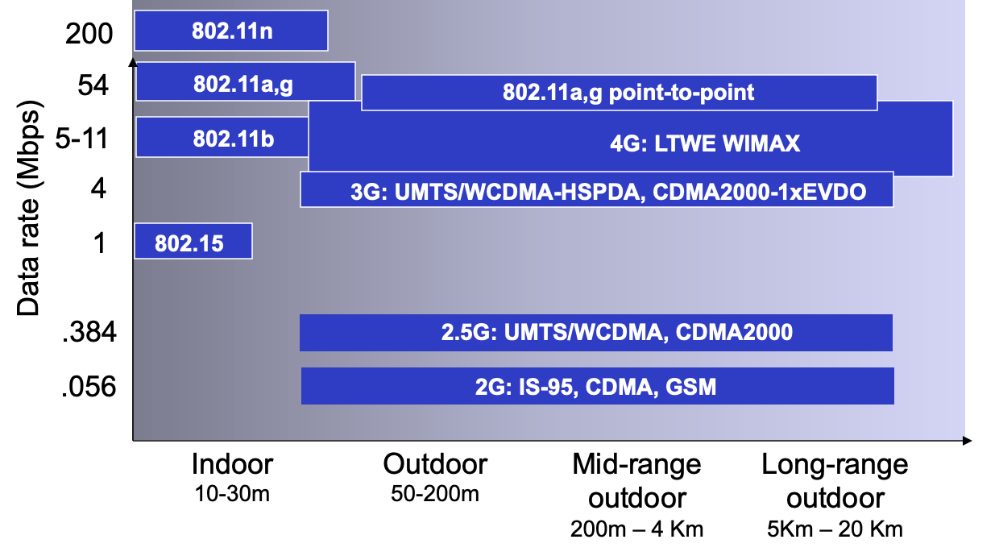
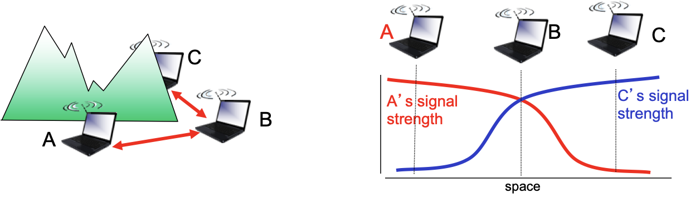
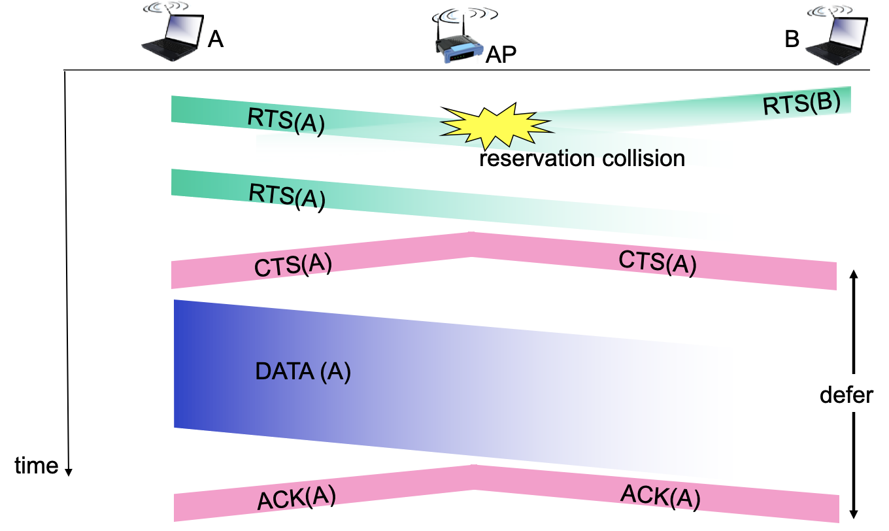

# Chapter 6. Wireless and Mobile Networks

## Introduction

- wireless ≠ mobility

  - wireless: wireless link를 통해 통신
  - mobility: 네트워크 엑세스 포인트(base station)가 변경될 수 있음(= handoff)

- wireless hosts: 노트북, 스마트폰 등

- base station

  - wired 네트워크로 연결되어 있고, 자신의 커버리지 안에서 wired network와 wireless host 간 패킷을 전송해주는 역할
  - cell towers, 802.11 access points

- wireless link

  - wireless hosts - base station 연결
  - backbone link로 사용됨
  - multiple access protocol

  

## Wireless links, characteristics

- Wi-Fi 802.11b → 802.11a, g → 802.11n
- 2G: 음성 → 3G: 멀티미디어 → 4G: 대용량 멀티미디어

###  Wireless network taxonomy

|                   | single hop                                                   | multiple hops                                                |
| ----------------- | ------------------------------------------------------------ | ------------------------------------------------------------ |
| infrastructure    | host - base station 연결 - Wi-Fi - WIMAX - Cellular | host가 여러 개의 wireless nodes를 거쳐 네트워크 연결 - mesh net: host가 드문드문한 지역의 경우 비용을 줄이기 위해 base station에서 end host 사이에 중간 다리를 놓아줌 |
| no infrastructure | base station 없음 - Bluetooth - ad hoc nets        | base station 없음 hosts끼리 서로 연결 - MANET (mobile) - VANET (vehicle)  => 재난 현장에 투입되는 구조대원들의 모바일끼리 MANET 구축 |

### 특성

- decreased signal strenth : 매개체를 지나면서 신호가 약해짐

- interface from other sources : 표준화된 wireless network 주파수 대역이 있고, 이를 다른 디바이스와 공유함

- multiplath propagation : radio signal reflects off objects ground, arriving ad destination at slightly different times

- SNR : signal-to-noise ratio

  - larger SNR - 노이즈에서 신호를 추출하기가 더 쉬움

- Hidden terminal Problem

  

- CSMA: data 보내기 전에 먼저 채널이 비어있는지 들어봄

- CSMA/CA (Collision  Avoidance)

  

  - RTS: Request to send
  - CTS: Clear to send
  - RTS로 예약 => 수용되면 CTS 브로드캐스팅 => 데이터 전송

